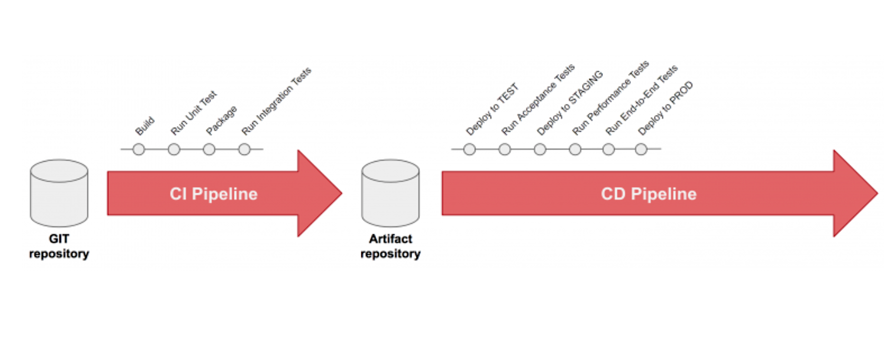

# CI/CD
> 在软件工程中，CI/CD或CICD通常指的是持续集成和持续交付或持续部署的组合实践。
> ——引自[维基百科](https://zh.wikipedia.org/wiki/CI/CD)




## CI可以做什么？

> 现代应用开发的目标是让多位开发人员同时处理同一应用的不同功能。但是，如果企业安排在一天内将所有分支源代码合并在一起（称为“合并日”），最终可能造成工作繁琐、耗时，而且需要手动完成。这是因为当一位独立工作的开发人员对应用进行更改时，有可能会与其他开发人员同时进行的更改发生冲突。如果每个开发人员都自定义自己的本地集成开发环境（IDE），而不是让团队就一个基于云的 IDE 达成一致，那么就会让问题更加雪上加霜。

> 持续集成（CI）可以帮助开发人员更加频繁地（有时甚至每天）将代码更改合并到共享分支或“主干”中。一旦开发人员对应用所做的更改被合并，系统就会通过自动构建应用并运行不同级别的自动化测试（通常是单元测试和集成测试）来验证这些更改，确保这些更改没有对应用造成破坏。这意味着测试内容涵盖了从类和函数到构成整个应用的不同模块。如果自动化测试发现新代码和现有代码之间存在冲突，CI 可以更加轻松地快速修复这些错误。

> ——引自[《CI/CD是什么？如何理解持续集成、持续交付和持续部署》](https://www.redhat.com/zh/topics/devops/what-is-ci-cd)

从概念上来看，CI/CD包含部署过程，我们这里将部署(CD)单独放在一节[服务部署](service-deployment.md)，
本节就以gitlab来做简单的CI（Run Unit Test）演示。

## gitlab CI
Gitlab CI/CD是Gitlab内置的软件开发工具，提供
* 持续集成(CI)
* 持续交付(CD)
* 持续部署(CD)

## 准备工作
* gitlab安装
* git安装
* gitlab runner安装

## 开启gitlab CI
* 上传代码
    * 在gitlab新建一个仓库`go-zero-demo`
    * 将本地代码上传到`go-zero-demo`仓库
* 在项目根目录下创建`.gitlab-ci.yaml`文件，通过此文件可以创建一个pipeline，其会在代码仓库中有内容变更时运行，pipeline由一个或多个按照顺序运行，
  每个阶段可以包含一个或者多个并行运行的job。
* 添加CI内容(仅供参考)

    ```yaml
    stages:
    - analysis
    
    analysis:
    stage: analysis
    image: golang
    script:
    - go version && go env
    - go test -short $(go list ./...) | grep -v "no test"
    ```

> [!TIP]
> 以上CI为简单的演示，详细的gitlab CI请参考gitlab官方文档进行更丰富的CI集成。


# 参考文档
* [CI/CD 维基百科](https://zh.wikipedia.org/wiki/CI/CD)
* [CI/CD是什么？如何理解持续集成、持续交付和持续部署](https://www.redhat.com/zh/topics/devops/what-is-ci-cd)
* [Gitlab CI](https://docs.gitlab.com/ee/ci/)