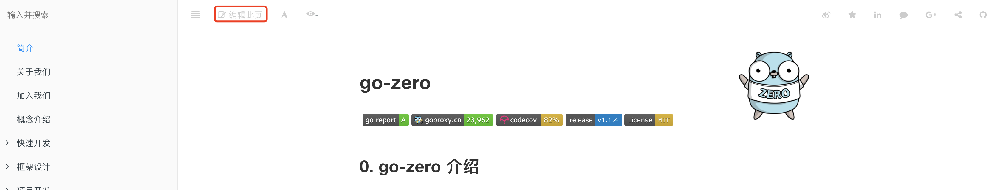

# 文档贡献

## 怎么贡献文档？
点击顶部"编辑此页"按钮即可进入源码仓库对应的文件，开发人员将修改（添加）的文档通过pr形式提交，
我们收到pr后会进行文档审核，一旦审核通过即可更新文档。


## 可以贡献哪些文档？
* 文档编写错误
* 文档不规范、不完整
* go-zero应用实践、心得
* 组件中心

## 文档pr通过后文档多久会更新？
在pr接受后，github action会自动build gitbook并发布，因此在github action成功后1-2分钟即可查看更新后的文档。

## 文档贡献注意事项
* 纠错、完善源文档可以直接编写原来的md文件
* 新增组件文档需要保证文档排版、易读，且组件文档需要放在[组件中心](extended-reading.md)子目录中
* go-zero应用实践分享可以直接放在[开发实践](practise.md)子目录下

## 目录结构规范
* 目录结构不宜过深，最好不要超过3层
* 组件文档需要在归属到[组件中心](extended-reading.md)，如
  ```markdown
  * [开发实践](practise.md)
    * [logx](logx.md)
    * [bloom](bloom.md)
    * [executors](executors.md)
    * 你的文档目录名称
  ```
* 应用实践需要归属到[开发实践](practise.md)，如
  ```markdown
  * [开发实践](practise.md)
    * [我是如何用go-zero 实现一个中台系统](datacenter.md)
    * [流数据处理利器](stream.md)
    * [10月3日线上交流问题汇总](online-exchange.md
    * 你的文档目录名称
  ```

## 开发实践文档模板
  ```markdown
  # 标题
  
  > 作者：填入作者名称
  >
  > 原文连接： 原文连接
  
  some markdown content
  ```

# 猜你想看
* [怎么参与贡献](join-us.md)
* [Github Pull request](https://docs.github.com/en/github/collaborating-with-issues-and-pull-requests/proposing-changes-to-your-work-with-pull-requests)

