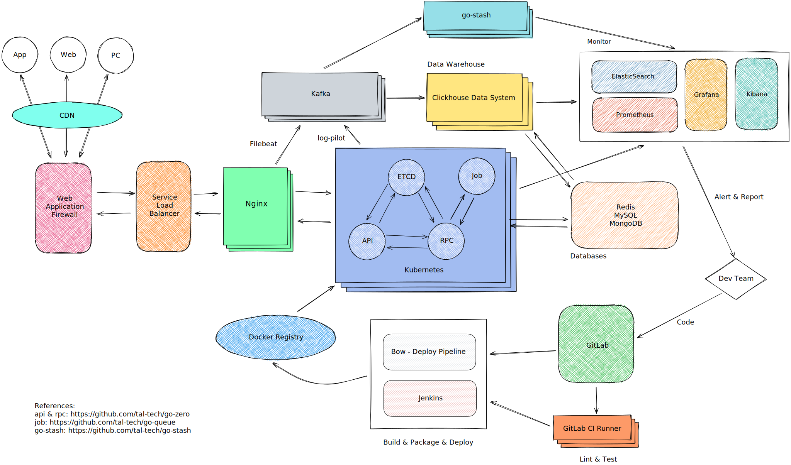

# 框架设计

本节将从 go-zero 的设计理念，go-zero 服务的最佳实践目录来说明 go-zero 框架的设计，本节将包含以下小节：

* [go-zero设计理念](go-zero-design.md)
* [go-zero特点](go-zero-features.md)
* [api语法介绍](api-grammar.md)
* [api目录结构](api-dir.md)
* [rpc目录结构](rpc-dir.md)
