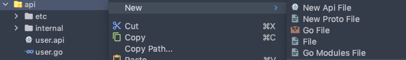
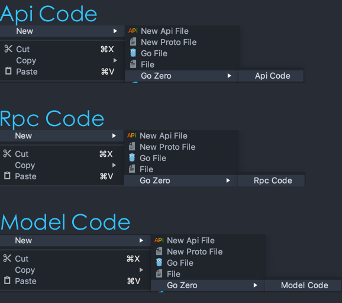
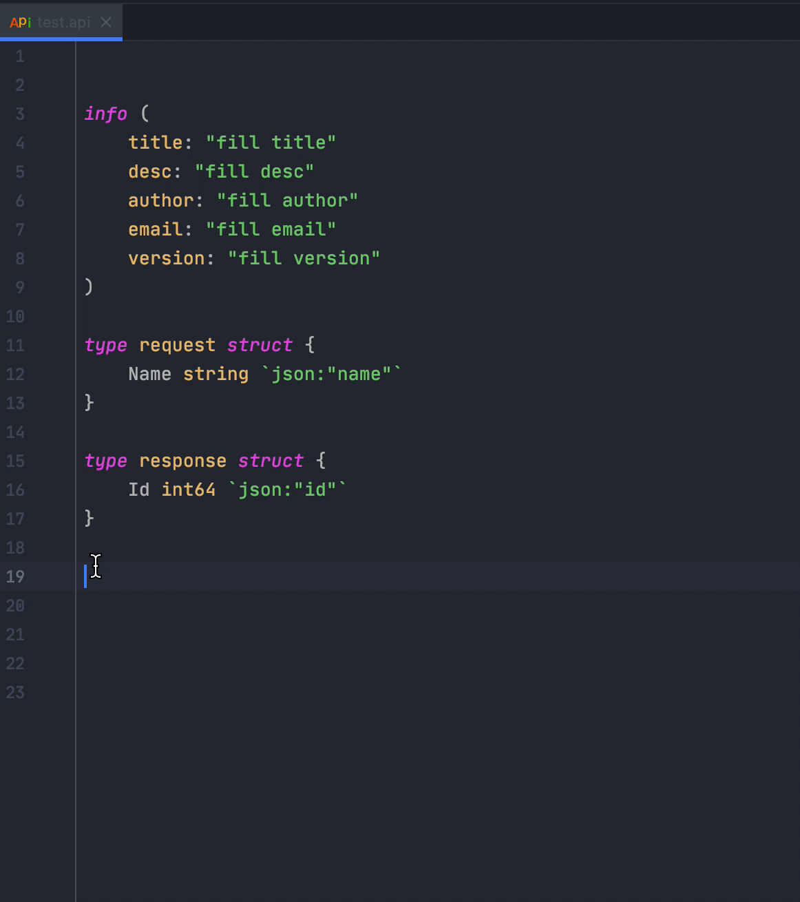
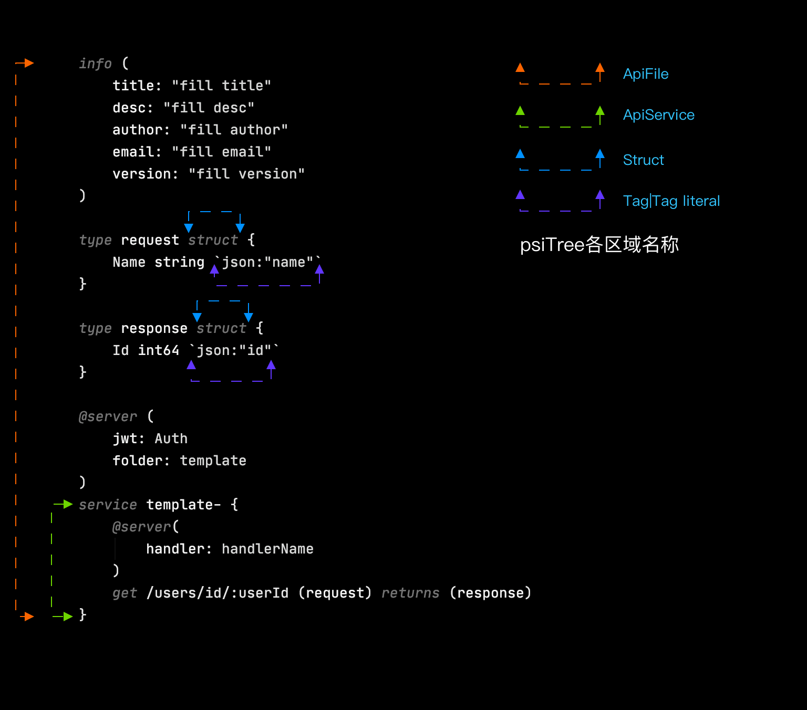

# intellij插件

## Go-Zero Plugin

[](https://github.com/tal-tech/go-zero)
[](https://github.com/zeromicro/goctl-intellij/blob/main/LICENSE)
[](https://github.com/zeromicro/goctl-intellij/releases)
[](https://github.com/zeromicro/goctl-intellij/actions)

## 介绍
一款支持go-zero api语言结构语法高亮、检测以及api、rpc、model快捷生成的插件工具。


## idea版本要求
* IntelliJ 2019.3+ (Ultimate or Community)
* Goland 2019.3+
* WebStorm 2019.3+
* PhpStorm 2019.3+
* PyCharm 2019.3+
* RubyMine 2019.3+
* CLion 2019.3+

## 版本特性
* api语法高亮
* api语法、语义检测
* struct、route、handler重复定义检测
* type跳转到类型声明位置
* 上下文菜单中支持api、rpc、mode相关menu选项
* 代码格式化(option+command+L)
* 代码提示

## 安装方式

### 方式一
在github的release中找到最新的zip包，下载本地安装即可。（无需解压）

### 方式二
在plugin商店中，搜索`Goctl`安装即可


## 预览


## 新建 Api(Proto) file
在工程区域目标文件夹`右键->New-> New Api(Proto) File ->Empty File/Api(Proto) Template`,如图：


# 快速生成api/rpc服务
在目标文件夹`右键->New->Go Zero -> Api Greet Service/Rpc Greet Service`


# Api/Rpc/Model Code生成

## 方法一(工程区域)

对应文件（api、proto、sql）`右键->New->Go Zero-> Api/Rpc/Model Code`,如图：



## 方法二（编辑区域）
对应文件（api、proto、sql）`右键-> Generate-> Api/Rpc/Model Code`


# 错误提示


# Live Template
Live Template可以加快我们对api文件的编写，比如我们在go文件中输入`main`关键字根据tip回车后会插入一段模板代码
```go
func main(){

}
```
或者说看到下图你会更加熟悉，曾几何时你还在这里定义过template


下面就进入今天api语法中的模板使用说明吧，我们先来看看service模板的效果


首先上一张图了解一下api文件中几个模板生效区域（psiTree元素区域）


#### 预设模板及生效区域
|  模板关键字   | psiTree生效区域 |描述
|  ----  | ----  | ----  | 
| @doc  | ApiService |doc注释模板|
| doc  | ApiService |doc注释模板|
| struct  | Struct |struct声明模板|
| info  | ApiFile |info block模板|
| type  | ApiFile |type group模板|
| handler  | ApiService |handler文件名模板|
| get  | ApiService |get方法路由模板|
| head  | ApiService |head方法路由模板|
| post  | ApiService |post方法路由模板|
| put  | ApiService |put方法路由模板|
| delete  | ApiService |delete方法路由模板|
| connect  | ApiService |connect方法路由模板|
| options  | ApiService |options方法路由模板|
| trace  | ApiService |trace方法路由模板|
| service  | ApiFile |service服务block模板|
| json  | Tag、Tag literal |tag模板|
| xml  | Tag、Tag literal |tag模板|
| path  | Tag、Tag literal |tag模板|
| form  | Tag、Tag literal |tag模板|

关于每个模板对应内容可在`Goland(mac Os)->Preference->Editor->Live Templates-> Api|Api Tags`中查看详细模板内容，如json tag模板内容为
```go
json:"$FIELD_NAME$"
```


