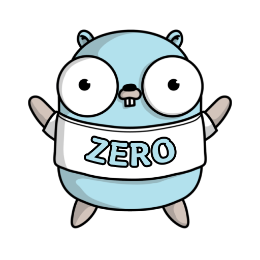
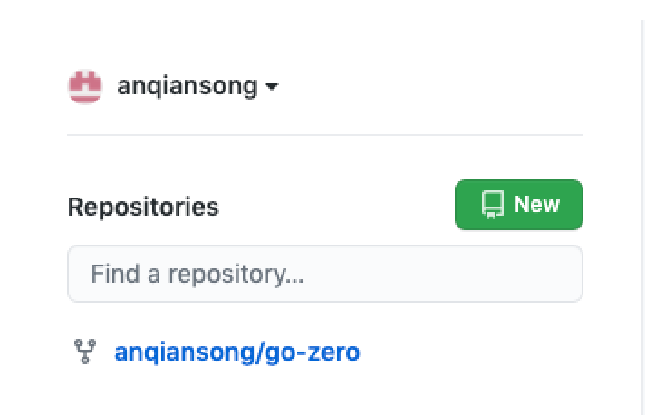
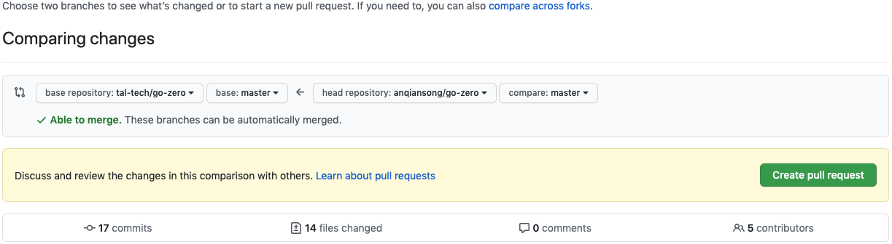

# 加入我们

## 概要

[go-zero](https://github.com/zeromicro/go-zero) 是一个基于[MIT License](https://github.com/zeromicro/go-zero/blob/master/LICENSE) 的开源项目，大家在使用中发现bug，有新的特性等，均可以参与到go-zero的贡献中来，我们非常欢迎大家的积极参与，也会最快响应大家提出的各种问题，pr等。

## 贡献形式
* [Pull Request](https://github.com/zeromicro/go-zero/pulls)
* [Issue](https://github.com/zeromicro/go-zero/issues)

## 贡献须知
go-zero 的Pull request中的代码需要满足一定规范
* 命名规范，请阅读[命名规范](naming-spec.md)
* 以英文注释为主
* pr时备注好功能特性，描述需要清晰，简洁
* 增加单元测试覆盖率达80%+

## 贡献代码（pr）
* 进入[go-zero](https://github.com/zeromicro/go-zero) 项目，fork一份[go-zero](https://github.com/zeromicro/go-zero) 项目到自己的github仓库中。
* 回到自己的github主页，找到`xx/go-zero`项目，其中xx为你的用户名，如`anqiansong/go-zero`

    
* 克隆代码到本地

    
* 开发代码，push到自己的github仓库
* 进入自己的github中go-zero项目，点击浮层上的的`【Pull requests】`进入Compare页面。

    

* `base repository`选择`tal-tech/go-zero` `base:master`,`head repository`选择`xx/go-zero` `compare:$branch` ，`$branch`为你开发的分支，如图：

    

* 点击`【Create pull request】`即可实现pr申请
* 确认pr是否提交成功，进入[go-zero](https://github.com/zeromicro/go-zero) 的[Pull requests](https://github.com/zeromicro/go-zero/pulls) 查看，应该有自己提交的记录，名称为你的开发时的分支名称

    

## Issue
在我们的社区中，有很多伙伴会积极的反馈一些go-zero使用过程中遇到的问题，由于社区人数较多，我们虽然会实时的关注社区动态，但大家问题反馈过来都是随机的，当我们团队还在解决某一个伙伴提出的问题时，另外的问题也反馈上来，可能会导致团队会很容易忽略掉，为了能够一一的解决大家的问题，我们强烈建议大家通过issue的方式来反馈问题，包括但不限于bug，期望的新功能特性等，我们在实现某一个新特性时也会在issue中体现，大家在这里也能够在这里获取到go-zero的最新动向，也欢迎大家来积极的参与讨论。

### 怎么提Issue
* 点击[这里](https://github.com/zeromicro/go-zero/issues) 进入go-zero的Issue页面或者直接访问[https://github.com/zeromicro/go-zero/issues](https://github.com/zeromicro/go-zero/issues) 地址
* 点击右上角的`【New issue】`新建issue
* 填写issue标题和内容
* 点击`【Submit new issue】`提交issue

## 参考文档

* [Github Pull request](https://docs.github.com/en/github/collaborating-with-issues-and-pull-requests/proposing-changes-to-your-work-with-pull-requests)