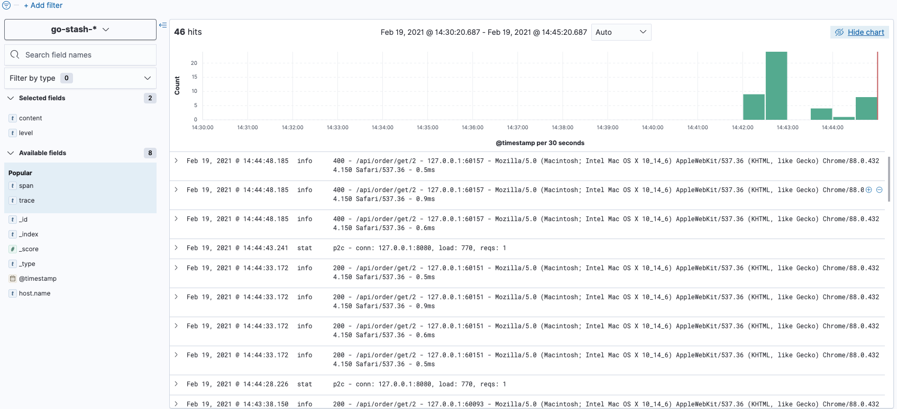

# 日志收集
为了保证业务稳定运行，预测服务不健康风险，日志的收集可以帮助我们很好的观察当前服务的健康状况，
在传统业务开发中，机器部署还不是很多时，我们一般都是直接登录服务器进行日志查看、调试，但随着业务的增大，服务的不断拆分，
服务的维护成本也会随之变得越来越复杂，在分布式系统中，服务器机子增多，服务分布在不同的服务器上，当遇到问题时，
我们不能使用传统做法，登录到服务器进行日志排查和调试，这个复杂度可想而知。


> [!TIP]
> 如果是一个简单的单体服务系统或者服务过于小不建议直接使用，否则会适得其反。

## 准备工作
* kafka
* elasticsearch
* kibana
* filebeat、Log-Pilot（k8s）
* go-stash

## filebeat配置
```shell
$ vim xx/filebeat.yaml
```

```yaml
filebeat.inputs:
- type: log
  enabled: true
  # 开启json解析
  json.keys_under_root: true
  json.add_error_key: true
  # 日志文件路径
  paths:
    - /var/log/order/*.log

setup.template.settings:
  index.number_of_shards: 1

# 定义kafka topic field
fields:
  log_topic: log-collection

# 输出到kafka
output.kafka:
  hosts: ["127.0.0.1:9092"]
  topic: '%{[fields.log_topic]}'
  partition.round_robin:
    reachable_only: false
  required_acks: 1
  keep_alive: 10s

# ================================= Processors =================================
processors:
  - decode_json_fields:
      fields: ['@timestamp','level','content','trace','span','duration']
      target: ""
```

> [!TIP]
> xx为filebeat.yaml所在路径

## go-stash配置
* 新建`config.yaml`文件
* 添加配置内容

```shell
$ vim config.yaml
```

```yaml
Clusters:
- Input:
    Kafka:
      Name: go-stash
      Log:
        Mode: file
      Brokers:
      - "127.0.0.1:9092"
      Topics: 
      - log-collection
      Group: stash
      Conns: 3
      Consumers: 10
      Processors: 60
      MinBytes: 1048576
      MaxBytes: 10485760
      Offset: first
  Filters:
  - Action: drop
    Conditions:
      - Key: status
        Value: "503"
        Type: contains
      - Key: type
        Value: "app"
        Type: match
        Op: and
  - Action: remove_field
    Fields:
    - source
    - _score
    - "@metadata"
    - agent
    - ecs
    - input
    - log
    - fields
  Output:
    ElasticSearch:
      Hosts:
      - "http://127.0.0.1:9200"
      Index: "go-stash-{{yyyy.MM.dd}}"
      MaxChunkBytes: 5242880
      GracePeriod: 10s
      Compress: false
      TimeZone: UTC
```

## 启动服务(按顺序启动)
* 启动kafka
* 启动elasticsearch
* 启动kibana
* 启动go-stash
* 启动filebeat
* 启动order-api服务及其依赖服务（go-zero-demo工程中的order-api服务）

## 访问kibana
进入127.0.0.1:5601


> [!TIP]
> 这里仅演示收集服务中通过logx产生的日志，nginx中日志收集同理。


# 参考文档
* [kafka](http://kafka.apache.org/)
* [elasticsearch](https://www.elastic.co/cn/elasticsearch/)
* [kibana](https://www.elastic.co/cn/kibana)
* [filebeat](https://www.elastic.co/cn/beats/filebeat)
* [go-stash](https://github.com/kevwan/go-stash)
* [filebeat配置](https://www.elastic.co/guide/en/beats/filebeat/current/index.html)
