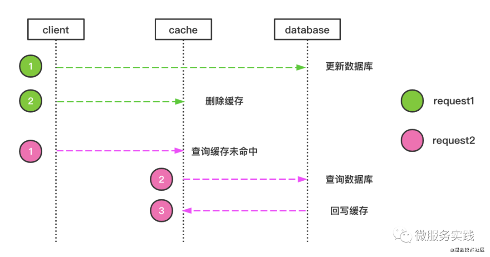

# Business layer cache

> [!TIP]
> This document is machine-translated by Google. If you find grammatical and semantic errors, and the document description is not clear, please [PR](doc-contibute.md)

In the previous article [Persistent Layer Cache](redis-cache.md), the db layer cache was introduced. In retrospect, the main design of the db layer cache can be summarized as follows:

* The cache is only deleted but not updated
* Only one row record is always stored, that is, the row record corresponding to the primary key
* The unique index only caches the primary key value, not the row record directly (refer to the mysql index idea)
* Anti-cache penetration design, one minute by default
* Do not cache multi-line records

## Preface

In a large-scale business system, by adding a cache to the persistence layer, for most single-line record queries, 
it is believed that the cache can help the persistence layer reduce a lot of access pressure, but in actual business, 
data reading is not just a single-line record.
In the face of many multi-line records, this will also cause a lot of access pressure on the persistence layer. 
In addition, it is unrealistic to rely solely on the persistence layer for high-concurrency scenarios such as the spike system and the course selection system. 
In this section, we introduce the cache design in go-zero practice-biz cache.

## Examples of applicable scenarios

* subject system
* Content social system
* Spike...

Like these systems, we can add another layer of cache to the business layer to store key information in the system, 
such as the student selection information in the course selection system, the remaining number of courses in the course selection system, 
and the content information during a certain period of time in the content social system.

Next, let's take an example of a content social system.

In the content social system, we generally query a batch of content lists first, 
and then click on a piece of content to view the details.

Before adding biz cache, the query flowchart of content information should be:



From the figure and the previous article [Persistence Layer Cache] (redis-cache.md), 
we can know that there is no way to get the content list to rely on the cache.
If we add a layer of cache to the business layer to store the key information (or even the complete information) in the list, 
then access to multiple rows of records is no longer a problem, and this is what biz redis will do. Next, 
let’s take a look at the design plan, assuming that a single-line record in the content system contains the following fields.

|Field Name|Field Type|Remarks|
|---|---|---|
|id|string|Content id|
|title|string|Title|
|content|string|Content|
|createTime|time.Time|Create time|

Our goal is to obtain a batch of content lists, and try to avoid the access pressure caused by the content list going to the db. 
First, we use the sort set data structure of redis to store. The amount of field information that needs to be stored is based on 
two redis storage schemes:

* Cache local information
  
  
  The key field information (such as id, etc.) is compressed and stored according to certain rules. 
  For score, we use the `createTime` millisecond value (the time value is equal, not discussed here). 
  The advantage of this storage scheme is to save redis storage space.
  
  On the other hand, the disadvantage is that the detailed content of the list needs to be checked back again (but this back check will use the row record cache of the persistence layer)

* Cache complete information
  
  
  All published content will be stored after being compressed according to certain rules. For the same score, 
  we still use the `createTime` millisecond value. The advantage of this storage solution is that business additions, 
  deletions, checks, and changes are all redis, while the db layer is at this time.
  
  You don’t need to consider the row record cache. The persistence layer only provides data backup and recovery. 
  On the other hand, its shortcomings are also obvious. The storage space and configuration requirements are higher, and the cost will increase.

Sample code
```golang
type Content struct {
    Id         string    `json:"id"`
    Title      string    `json:"title"`
    Content    string    `json:"content"`
    CreateTime time.Time `json:"create_time"`
}

const bizContentCacheKey = `biz#content#cache`

// AddContent provides content storage
func AddContent(r redis.Redis, c *Content) error {
    v := compress(c)
    _, err := r.Zadd(bizContentCacheKey, c.CreateTime.UnixNano()/1e6, v)
    return err
}

// DelContent provides content deletion
func DelContent(r redis.Redis, c *Content) error {
    v := compress(c)
    _, err := r.Zrem(bizContentCacheKey, v)

    return err
}

// Content compression
func compress(c *Content) string {
    // todo: do it yourself
    var ret string
    return ret
}

// Content decompression
func unCompress(v string) *Content {
	// todo: do it yourself
	var ret Content
	return &ret
}

// ListByRangeTime provides data query based on time period
func ListByRangeTime(r redis.Redis, start, end time.Time) ([]*Content, error) {
	kvs, err := r.ZrangebyscoreWithScores(bizContentCacheKey, start.UnixNano()/1e6, end.UnixNano()/1e6)
	if err != nil {
		return nil, err
	}

	var list []*Content
	for _, kv := range kvs {
		data:=unCompress(kv.Key)
		list = append(list, data)
	}

	return list, nil
}

```

In the above example, redis does not set an expiration time. We will synchronize the add, delete, modify, 
and check operations to redis. We think that the content social system has a relatively high list access request to do this scheme design.
In addition, there are also some data visits. I did not expect the content design system to visit so frequently. 
It may be a sudden increase in visits within a certain period of time, and then it may be visited again for a long time. At this interval,
In other words, I will not visit again. In this scenario, how should I consider the design of the cache? 
In the practice of go-zero content, there are two solutions to this problem:

* Increased memory cache: The memory cache is used to store data that may have a large amount of sudden access. Commonly used storage schemes use map data structure to store. 
  Map data storage is relatively simple to implement, but cache expiration processing needs to be increased
  The timer comes out, another solution is through [Cache](https://github.com/zeromicro/go-zero/blob/master/core/collection/cache.go) in the go-zero library, It is specialized
  Used for memory management.
* Use biz redis and set a reasonable expiration time

# Summary
The above two scenarios can contain most of the multi-line record cache. For scenarios where the query volume of multi-line records is not large, 
there is no need to put biz redis directly in it. You can try to let db take care of it first, and developers can monitor according to the persistence layer. And service
Biz needs to be introduced when monitoring to measure.
