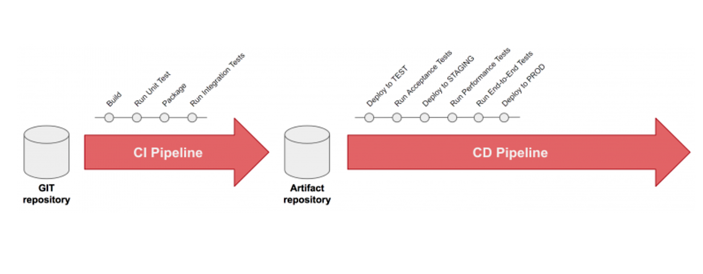

# CI/CD
> [!TIP]
> This document is machine-translated by Google. If you find grammatical and semantic errors, and the document description is not clear, please [PR](doc-contibute.md)


> In software engineering, CI/CD or CICD generally refers to the combined practices of continuous integration and either continuous delivery or continuous deployment.
> 
> ——[Wikipedia](https://zh.wikipedia.org/wiki/CI/CD)




## What can CI do?

> In modern application development, the goal is to have multiple developers working simultaneously on different features of the same app. However, if an organization is set up to merge all branching source code together on one day (known as “merge day”), the resulting work can be tedious, manual, and time-intensive. That’s because when a developer working in isolation makes a change to an application, there’s a chance it will conflict with different changes being simultaneously made by other developers. This problem can be further compounded if each developer has customized their own local integrated development environment (IDE), rather than the team agreeing on one cloud-based IDE.

> ——[Continuous integration](https://www.redhat.com/en/topics/devops/what-is-ci-cd)

From a conceptual point of view, CI/CD includes the deployment process. Here, we will put the deployment (CD) in a separate section [Service Deployment](service-deployment.md),
This section uses gitlab to do a simple CI (Run Unit Test) demonstration.

## Gitlab CI
Gitlab CI/CD is a built-in software development tool of Gitlab, providing
* Continuous Integration (CI)
* Continuous Delivery (CD)
* Continuous deployment (CD)

## Prepare
* gitlab installation
* git installation
* gitlab runner installation

## Enable Gitlab CI
* Upload code
  * Create a new warehouse `go-zero-demo` in gitlab
  * Upload the local code to the `go-zero-demo` warehouse
* Create a `.gitlab-ci.yaml` file in the project root directory. Through this file, a pipeline can be created, which will be run when there is a content change in the code repository. The pipeline is run in sequence by one or more.
  Each stage can contain one or more jobs running in parallel.
* Add CI content (for reference only)

    ```yaml
    stages:
    - analysis
    
    analysis:
    stage: analysis
    image: golang
    script:
    - go version && go env
    - go test -short $(go list ./...) | grep -v "no test"
    ```

> [!TIP]
> The above CI is a simple demonstration. For detailed gitlab CI, please refer to the official gitlab documentation for richer CI integration.


# Reference
* [CI/CD Wikipedia](https://zh.wikipedia.org/wiki/CI/CD)
* [Continuous integration](https://www.redhat.com/en/topics/devops/what-is-ci-cd)
* [Gitlab CI](https://docs.gitlab.com/ee/ci/)