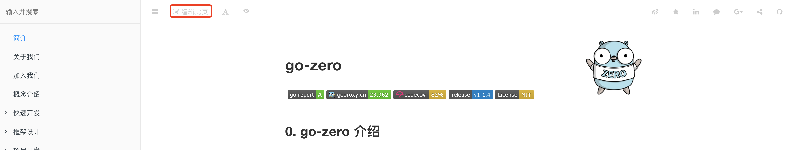

# Document Contribute
> [!TIP]
> This document is machine-translated by Google. If you find grammatical and semantic errors, and the document description is not clear, please [PR](doc-contibute.md)

## How to contribute documents?
Click the "Edit this page" button at the top to enter the file corresponding to the source code repository, and the developer will submit the modified (added) document in the form of pr,
After we receive the pr, we will conduct a document review, and once the review is passed, the document can be updated.



## What documents can I contribute?
* Documentation errors
* The documentation is not standardized and incomplete
* Go-zero application practice and experience
* Component Center

## How soon will the document be updated after the document pr is passed?
After pr accepts, github action will automatically build gitbook and release, so you can view the updated document 1-2 minutes after github action is successful.

## Documentation contribution notes
* Error correction and improvement of the source document can directly write the original md file
* The newly added component documents need to be typeset and easy to read, and the component documents need to be placed in the [Components](extended-reading.md) subdirectory
* Go-zero application practice sharing can be directly placed in the [Development Practice](practise.md) subdirectory

## Directory structure specification
* The directory structure should not be too deep, preferably no more than 3 levels
* The component document needs to be attributed to [Component Center] (component-center.md), such as
   * [Development Practice](practise.md)
   * [logx](logx.md)
   * [bloom](bloom.md)
   * [executors](executors.md)
   * Your document directory name
* Application practice needs to be attributed to [Development Practice](practise.md), such as
   * [Development Practice](practise.md)
   * [How do I use go-zero to implement a middle-office system] (datacenter.md)
   * [Stream data processing tool](stream.md)
   * [Summary of online communication issues on October 3](online-exchange.md
   * Your document directory name

## Development Practice Document Template
  ```markdown
  # Title
  
  > Author：The author name
  >
  > Original link： The original link
  
  some markdown content
  ```

# Guess you wants
* [Join Us](join-us.md)
* [Github Pull request](https://docs.github.com/en/github/collaborating-with-issues-and-pull-requests/proposing-changes-to-your-work-with-pull-requests)

