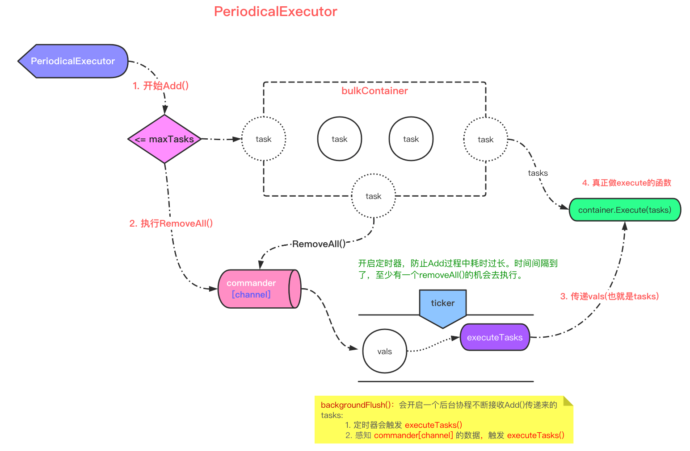

# executors
> [!TIP]
> This document is machine-translated by Google. If you find grammatical and semantic errors, and the document description is not clear, please [PR](doc-contibute.md)

In `go-zero`, `executors` act as a task pool, do multi-task buffering, and use tasks for batch processing. Such as: `clickhouse` large batch `insert`, `sql batch insert`. At the same time, you can also see `executors` in `go-queue` [In `queue`, `ChunkExecutor` is used to limit the byte size of task submission].

So when you have the following requirements, you can use this component:

- Submit tasks in batches
- Buffer part of tasks and submit lazily
- Delay task submission


Before explaining it in detail, let's give a rough overview:

## Interface design


Under the `executors` package, there are the following `executors`:

| Name | Margin value |
| --- | --- |
| `bulkexecutor` | Reach `maxTasks` [Maximum number of tasks] Submit |
| `chunkexecutor` | Reach `maxChunkSize`[Maximum number of bytes] Submit |
| `periodicalexecutor` | `basic executor` |
| `delayexecutor` | Delay the execution of the passed `fn()` |
| `lessexecutor` |  |


You will see that except for the special functions of `delay` and `less`, the other three are all combinations of `executor` + `container`:


```go
func NewBulkExecutor(execute Execute, opts ...BulkOption) *BulkExecutor {
    // Option mode: It appears in many places in go-zero. In multiple configurations, better design ideas
    // https://halls-of-valhalla.org/beta/articles/functional-options-pattern-in-go,54/
	options := newBulkOptions()
	for _, opt := range opts {
		opt(&options)
	}
    // 1. task container: [execute the function that actually does the execution] [maxTasks execution critical point]
	container := &bulkContainer{
		execute:  execute,
		maxTasks: options.cachedTasks,
	}
    // 2. It can be seen that the underlying bulkexecutor depends on the periodicalexecutor
	executor := &BulkExecutor{
		executor:  NewPeriodicalExecutor(options.flushInterval, container),
		container: container,
	}

	return executor
}
```


And this `container` is an `interface`:


```go
TaskContainer interface {
    // Add task to container
    AddTask(task interface{}) bool
    // Is actually to execute the incoming execute func()
	Execute(tasks interface{})
	// When the critical value is reached, remove all tasks in the container and pass them to execute func() through the channel for execution
	RemoveAll() interface{}
}
```


This shows the dependency between:


- `bulkexecutor`：`periodicalexecutor` + `bulkContainer`
- `chunkexecutor`：`periodicalexecutor` + `chunkContainer`


> [!TIP]
> So if you want to complete your own `executor`, you can implement these three interfaces of `container`, and then combine with `periodicalexecutor`.

So back to the picture 👆, our focus is on the `periodicalexecutor`, and see how it is designed?


## How to use


First look at how to use this component in business:

There is a timed service to perform data synchronization from `mysql` to `clickhouse` at a fixed time every day:


```go
type DailyTask struct {
	ckGroup        *clickhousex.Cluster
	insertExecutor *executors.BulkExecutor
	mysqlConn      sqlx.SqlConn
}
```


Initialize `bulkExecutor`:

```go
func (dts *DailyTask) Init() {
    // insertIntoCk() is the real insert execution function [requires developers to write specific business logic by themselves]
	dts.insertExecutor = executors.NewBulkExecutor(
		dts.insertIntoCk,
		executors.WithBulkInterval(time.Second*3),	// The container will automatically refresh the task to execute every 3s.
		executors.WithBulkTasks(10240),				// The maximum number of tasks for the container. Generally set to a power of 2
	)
}
```

> [!TIP]
> An additional introduction: `clickhouse` is suitable for mass insertion, because the insert speed is very fast, mass insert can make full use of clickhouse


Main business logic preparation:


```go
func (dts *DailyTask) insertNewData(ch chan interface{}, sqlFromDb *model.Task) error {
	for item := range ch {
		if r, vok := item.(*model.Task); !vok {
			continue
		}
		err := dts.insertExecutor.Add(r)
		if err != nil {
			r.Tag = sqlFromDb.Tag
			r.TagId = sqlFromDb.Id
			r.InsertId = genInsertId()
			r.ToRedis = toRedis == constant.INCACHED
			r.UpdateWay = sqlFromDb.UpdateWay
            // 1. Add Task
			err := dts.insertExecutor.Add(r)
			if err != nil {
				logx.Error(err)
			}
		}
	}
    // 2. Flush Task container
	dts.insertExecutor.Flush()
    // 3. Wait All Task Finish
	dts.insertExecutor.Wait()
}
```

> [!TIP]
> You may be wondering why `Flush(), Wait()` is needed, and I will analyze it through the source code later.

There are 3 steps to use as a whole:


- `Add()`: Add to task
- `Flush()`: Refresh tasks in `container`
- `Wait()`: Wait for the completion of all tasks


## Source code analysis

> [!TIP]
> The main analysis here is `periodicalexecutor`, because the other two commonly used `executors` rely on it.


### Initialization

```go
func New...(interval time.Duration, container TaskContainer) *PeriodicalExecutor {
	executor := &PeriodicalExecutor{
		commander:   make(chan interface{}, 1),
		interval:    interval,
		container:   container,
		confirmChan: make(chan lang.PlaceholderType),
		newTicker: func(d time.Duration) timex.Ticker {
			return timex.NewTicker(interval)
		},
	}
    ...
	return executor
}
```


- `commander`: Pass the channel of `tasks`
- `container`: Temporarily store the task of `Add()`
- `confirmChan`: Block `Add()`, at the beginning of this time, `executeTasks()` will let go of blocking
- `ticker`: To prevent the blocking of `Add()`, there will be a chance to execute regularly and release the temporarily stored task in time


### Add()
After initialization, the first step in the business logic is to add task to `executor`:

```go
func (pe *PeriodicalExecutor) Add(task interface{}) {
	if vals, ok := pe.addAndCheck(task); ok {
		pe.commander <- vals
		<-pe.confirmChan
	}
}

func (pe *PeriodicalExecutor) addAndCheck(task interface{}) (interface{}, bool) {
	pe.lock.Lock()
	defer func() {
        // default false
		var start bool
		if !pe.guarded {
            // backgroundFlush() will reset guarded
			pe.guarded = true
			start = true
		}
		pe.lock.Unlock()
        // The backgroundFlush() in if will be executed when the first task is added. Background coroutine brush task
		if start {
			pe.backgroundFlush()
		}
	}()
	// Control maxTask, >=maxTask will pop and return tasks in the container
	if pe.container.AddTask(task) {
		return pe.container.RemoveAll(), true
	}

	return nil, false
}
```

In `addAndCheck()`, `AddTask()` is controlling the maximum number of tasks. If it exceeds the number of tasks, `RemoveAll()` will be executed, and the tasks pop of the temporarily stored `container` will be passed to the `commander`, followed by goroutine loop reading , And then execute tasks.

### backgroundFlush()
Start a background coroutine, and constantly refresh the tasks in the `container`:

```go
func (pe *PeriodicalExecutor) backgroundFlush() {
    // Encapsulate go func(){}
	threading.GoSafe(func() {
		ticker := pe.newTicker(pe.interval)
		defer ticker.Stop()

		var commanded bool
		last := timex.Now()
		for {
			select {
            // Get []tasks from channel
			case vals := <-pe.commander:
				commanded = true
                // Substance: wg.Add(1)
				pe.enterExecution()
                // Let go of the blocking of Add(), and the temporary storage area is also empty at this time. Just start a new task to join
				pe.confirmChan <- lang.Placeholder
                // Really execute task logic
				pe.executeTasks(vals)
				last = timex.Now()
			case <-ticker.Chan():
				if commanded {
                    // Due to the randomness of select, if the two conditions are met at the same time and the above is executed at the same time, this treatment is reversed and this paragraph is skipped.
                    // https://draveness.me/golang/docs/part2-foundation/ch05-keyword/golang-select/
					commanded = false
				} else if pe.Flush() {
                    // The refresh is complete and the timer is cleared. The temporary storage area is empty, start the next timed refresh
					last = timex.Now()
				} else if timex.Since(last) > pe.interval*idleRound {
                    // If maxTask is not reached, Flush() err, and last->now is too long, Flush() will be triggered again
                    // Only when this is reversed will a new backgroundFlush() background coroutine be opened
                    pe.guarded = false
					// Refresh again to prevent missing
					pe.Flush()
					return
				}
			}
		}
	})
}
```

Overall two processes:

- `commander` receives the tasks passed by `RemoveAll()`, then executes it, and releases the blocking of `Add()` to continue `Add()`
- It’s time for `ticker`, if the first step is not executed, it will automatically `Flush()` and execute the task.

### Wait()
In `backgroundFlush()`, a function is mentioned: `enterExecution()`:

```go
func (pe *PeriodicalExecutor) enterExecution() {
	pe.wgBarrier.Guard(func() {
		pe.waitGroup.Add(1)
	})
}

func (pe *PeriodicalExecutor) Wait() {
	pe.wgBarrier.Guard(func() {
		pe.waitGroup.Wait()
	})
}
```
By enumerating in this way, you can know why you have to bring `dts.insertExecutor.Wait()` at the end. Of course, you have to wait for all `goroutine tasks` to complete.

## Thinking
In looking at the source code, I thought about some other design ideas, do you have similar questions:

- In the analysis of `executors`, you will find that there are `lock` in many places

> [!TIP]
> There is a race condition in `go test`, use locking to avoid this situation

- After analyzing `confirmChan`, it was found that this [submit](https://github.com/tal-tech/go-zero/commit/9d9399ad1014c171cc9bd9c87f78b5d2ac238ce4) only appeared, why is it designed like this?

> It used to be: `wg.Add(1)` was written in `executeTasks()`; now it is: first `wg.Add(1)`, then release `confirmChan` blocking
> If the execution of `executor func` is blocked, `Add task` is still in progress, because there is no block, it may be executed to `Executor.Wait()` soon, and this is where `wg.Wait()` appears in `wg.Add ()` before execution, this will be `panic`

For details, please see the latest version of `TestPeriodicalExecutor_WaitFast()`, you may wish to run on this version to reproduce.

## Summary
There are still a few more analysis of `executors`, I leave it to you to look at the source code.

In short, the overall design:

- Follow interface-oriented design
- Flexible use of concurrent tools such as `channel` and `waitgroup`
- The combination of execution unit + storage unit

There are many useful component tools in `go-zero`. Good use of tools is very helpful to improve service performance and development efficiency. I hope this article can bring you some gains.
