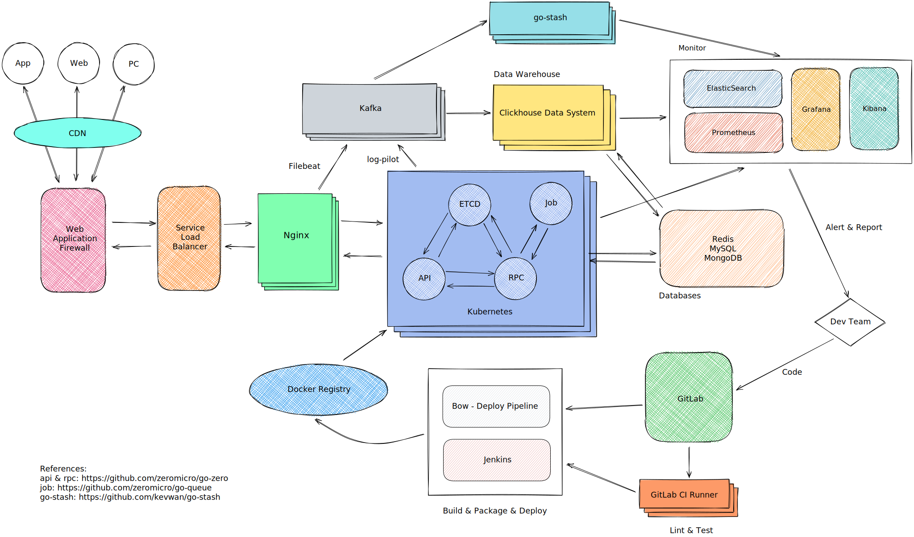

# Framework Design
> [!TIP]
> This document is machine-translated by Google. If you find grammatical and semantic errors, and the document description is not clear, please [PR](doc-contibute.md)

This section will explain the design of go-zero framework from the go-zero design philosophy and the best practice catalog of go-zero services. This section will contain the following subsections:

* [Go-Zero Design](go-zero-design.md)
* [Go-Zero Features](go-zero-features.md)
* [API IDL](api-grammar.md)
* [API Directory Structure](api-dir.md)
* [RPC Directory Structure](rpc-dir.md)
