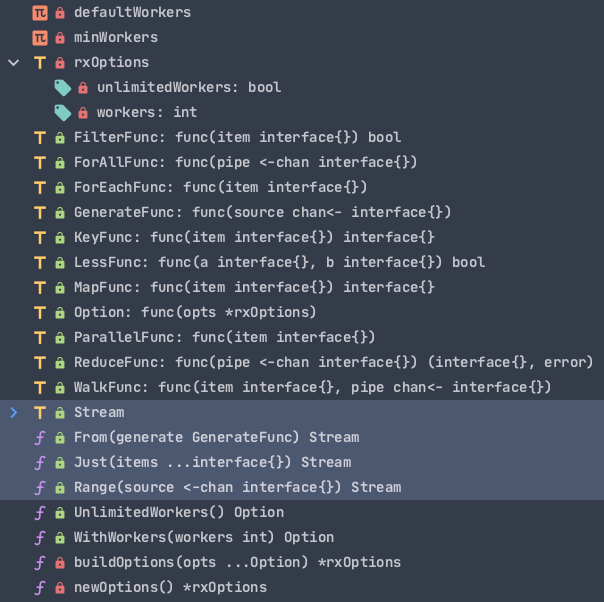
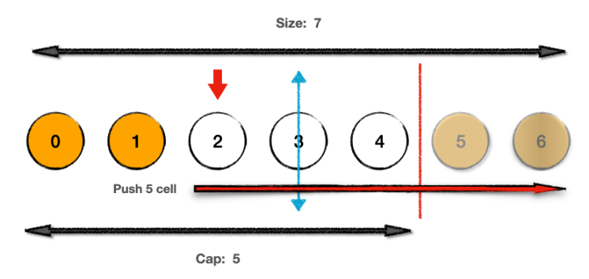

# fx
> [!TIP]
> This document is machine-translated by Google. If you find grammatical and semantic errors, and the document description is not clear, please [PR](doc-contibute.md)

`fx` is a complete stream processing component.
It is similar to `MapReduce`, `fx` also has a concurrent processing function: `Parallel(fn, options)`. But at the same time it is not only concurrent processing. `From(chan)`, `Map(fn)`, `Filter(fn)`, `Reduce(fn)`, etc., read from the data source into a stream, process the stream data, and finally aggregate the stream data. Is it a bit like Java Lambda? If you were a Java developer before, you can understand the basic design when you see this.

## Overall API
Let's get an overview of how `fx` is constructed as a whole:


The marked part is the most important part of the entire `fx`:

1. From APIs such as `From(fn)`, a data stream `Stream` is generated
2. A collection of APIs for converting, aggregating, and evaluating `Stream`


So list the currently supported `Stream API`:

| API | Function |
| --- | --- |
| `Distinct(fn)` | Select a specific item type in fn and de-duplicate it |
| `Filter(fn, option)` | fn specifies specific rules, and the `element` that meets the rules is passed to the next `stream` |
| `Group(fn)` | According to fn, the elements in `stream` are divided into different groups |
| `Head(num)` | Take out the first num elements in `stream` and generate a new `stream` |
| `Map(fn, option)` | Convert each ele to another corresponding ele and pass it to the next `stream` |
| `Merge()` | Combine all `ele` into one `slice` and generate a new `stream` |
| `Reverse()` | Reverse the element in `stream`. [Use double pointer] |
| `Sort(fn)` | Sort elements in `stream` according to fn |
| `Tail(num)` | Take out the last num elements of `stream` to generate a new `stream`. [Using a doubly linked list] |
| `Walk(fn, option)` | Apply fn to every element of `source`. Generate a new `stream` |


No longer generates a new `stream`, do the final evaluation operation:

| API | Function |
| --- | --- |
| `ForAll(fn)` | Process `stream` according to fn, and no longer generate `stream` [evaluation operation] |
| `ForEach(fn)` | Perform fn [evaluation operation] on all elements in `stream` |
| `Parallel(fn, option)` | Concurrently apply the given fn and the given number of workers to each `element`[evaluation operation] |
| `Reduce(fn)` | Directly process `stream` [evaluation operation] |
| `Done()` | Do nothing, wait for all operations to complete |


## How to use?

```go
result := make(map[string]string)
fx.From(func(source chan<- interface{}) {
  for _, item := range data {
    source <- item
  }
}).Walk(func(item interface{}, pipe chan<- interface{}) {
  each := item.(*model.ClassData)

  class, err := l.rpcLogic.GetClassInfo()
  if err != nil {
    l.Errorf("get class %s failed: %s", each.ClassId, err.Error())
    return
  }
  
  students, err := l.rpcLogic.GetUsersInfo(class.ClassId)
  if err != nil {
    l.Errorf("get students %s failed: %s", each.ClassId, err.Error())
    return
  }

  pipe <- &classObj{
    classId: each.ClassId
    studentIds: students
  }
}).ForEach(func(item interface{}) {
    o := item.(*classObj)
    result[o.classId] = o.studentIds
})
```


1. `From()` generates `stream` from a `slice`
2. `Walk()` receives and a `stream`, transforms and reorganizes each `ele` in the stream to generate a new `stream`
3. Finally, the `stream` output (`fmt.Println`), storage (`map,slice`), and persistence (`db operation`) are performed by the `evaluation operation`


## Briefly analyze

The function naming in `fx` is semantically. Developers only need to know what kind of conversion is required for the business logic and call the matching function.


So here is a brief analysis of a few more typical functions.

### Walk()

`Walk()` is implemented as the bottom layer by multiple functions throughout `fx`, such as `Map(), Filter()`, etc.

So the essence is: `Walk()` is responsible for concurrently applying the passed function to each `ele` of the **input stream** and generating a new `stream`.

Following the source code, it is divided into two sub-functions: custom count by `worker`, default count is `worker` 

```go
// Custom workers
func (p Stream) walkLimited(fn WalkFunc, option *rxOptions) Stream {
	pipe := make(chan interface{}, option.workers)

	go func() {
		var wg sync.WaitGroup
    // channel<- If the set number of workers is reached, the channel is blocked, so as to control the number of concurrency.
    // Simple goroutine pool
		pool := make(chan lang.PlaceholderType, option.workers)

		for {
      // Each for loop will open a goroutine. If it reaches the number of workers, it blocks
			pool <- lang.Placeholder
			item, ok := <-p.source
			if !ok {
				<-pool
				break
			}
			// Use WaitGroup to ensure the integrity of task completion
			wg.Add(1)
			threading.GoSafe(func() {
				defer func() {
					wg.Done()
					<-pool
				}()

				fn(item, pipe)
			})
		}

		wg.Wait()
		close(pipe)
	}()

	return Range(pipe)
}
```


- Use `buffered channel` as a concurrent queue to limit the number of concurrent
- `waitgroup` to ensure the completeness of the task completion

Another `walkUnlimited()`: also uses `waitgroup` for concurrency control, because there is no custom concurrency limit, so there is no other `channel` for concurrency control.


### Tail()

The introduction of this is mainly because the `ring` is a doubly linked list, and the simple algorithm is still very interesting.

```go
func (p Stream) Tail(n int64) Stream {
	source := make(chan interface{})

	go func() {
		ring := collection.NewRing(int(n))
    // Sequence insertion, the order of the source is consistent with the order of the ring
		for item := range p.source {
			ring.Add(item)
		}
    // Take out all the items in the ring
		for _, item := range ring.Take() {
			source <- item
		}
		close(source)
	}()

	return Range(source)
}
```


As for why `Tail()` can take out the last n of the source, this is left for everyone to fine-tune. Here is my understanding:


> [!TIP]
> Suppose there is the following scenario,`Tail(5)`
> - `stream size` ：7
> - `ring size`：5


Here you can use the method of pulling apart the ring-shaped linked list, **Loop-to-line**，At this point, divide the symmetry axis by the full length, flip the extra elements, and the following elements are the parts needed by `Tail(5)`.


> [!TIP]
> The graph is used here for a clearer performance, but everyone should also look at the code. Algorithm to be tested


### Stream Transform Design


Analyzing the entire `fx`, you will find that the overall design follows a design template:


```go
func (p Stream) Transform(fn func(item interface{}) interface{}) Stream {
	// make channel
	source := make(chan interface{})
    // goroutine worker
	go func() {
		// transform
        for item := range p.source {
			...
			source <- item
			...
		}
		...
		// Close the input, but still can output from this stream. Prevent memory leaks
		close(source)
	}()
	// channel -> stream
	return Range(source)
}
```


- `channel` as a container for streams
- Open `goroutine` to convert `source`, aggregate, and send to `channel`
- Processed,`close(outputStream)`
- `channel -> stream`


## Summary

This concludes the basic introduction of `fx`. If you are interested in other API source code, you can follow the API list above to read one by one.

At the same time, it is also recommended that you take a look at the API of `java stream`, and you can have a deeper understanding of this `stream call`.

At the same time, there are many useful component tools in `go-zero`. Good use of tools will greatly help improve service performance and development efficiency. I hope this article can bring you some gains.


## Reference
- [go-zero](https://github.com/zeromicro/go-zero)
- [Java Stream](https://colobu.com/2016/03/02/Java-Stream/)
- [Stream API in Java 8](https://mp.weixin.qq.com/s/xa98C-QUHRUK0BhWLzI3XQ)
