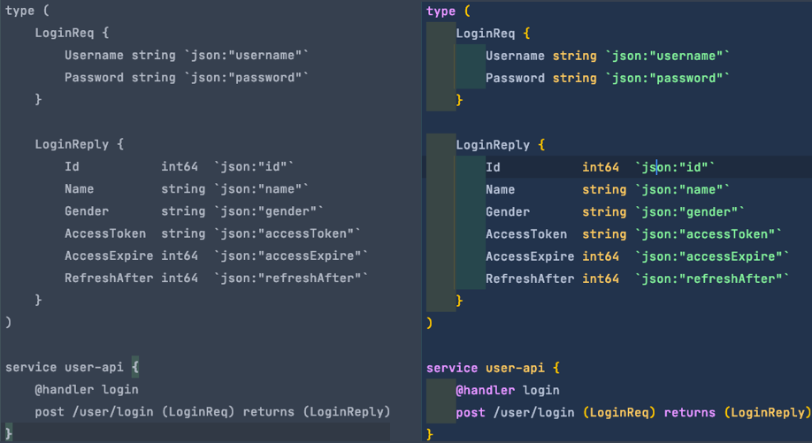
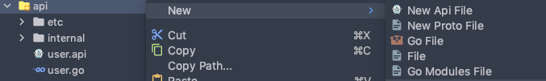
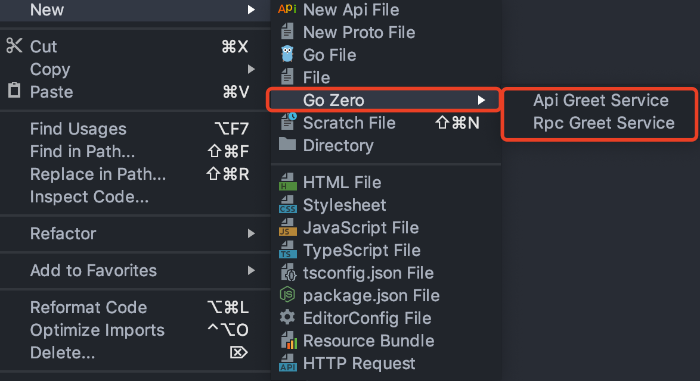
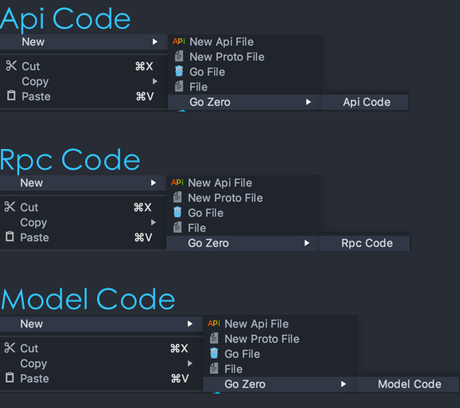
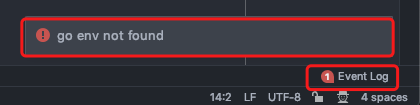
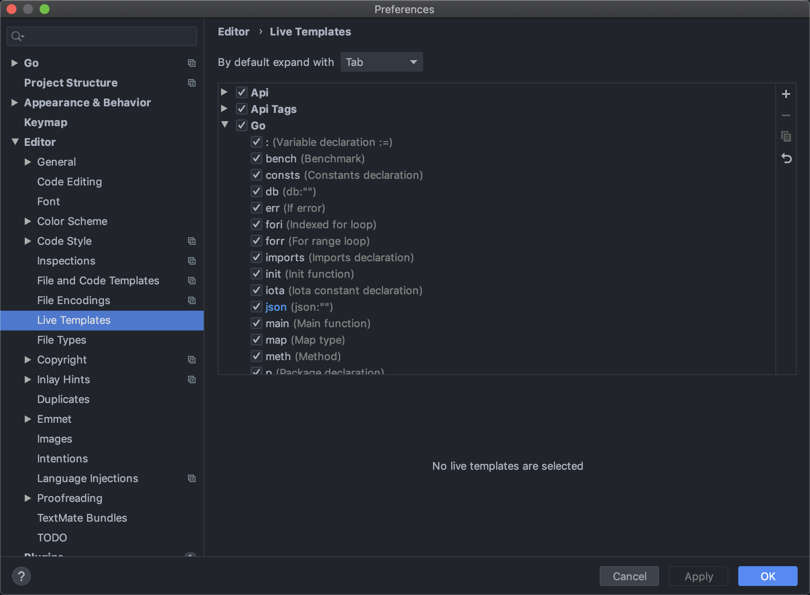
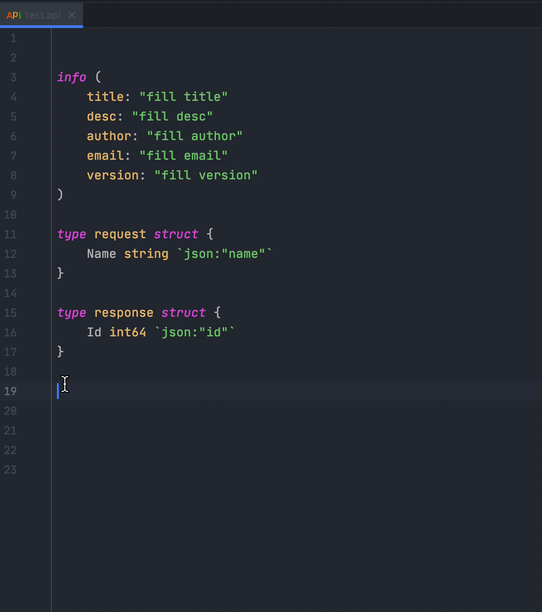
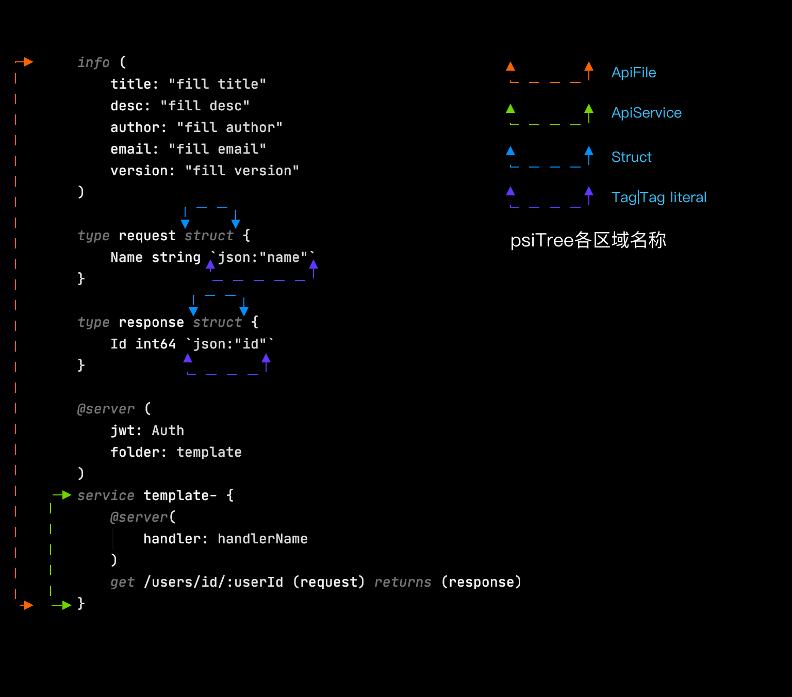
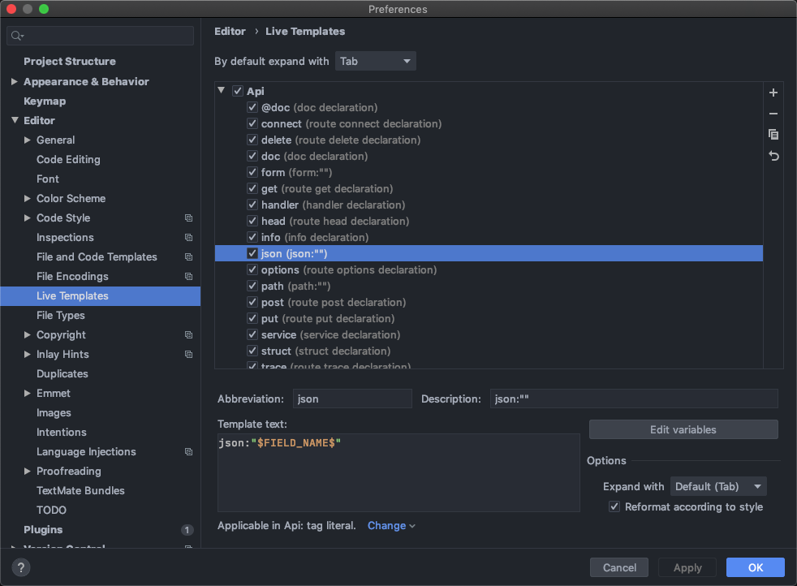

# Intellij Plugin
> [!TIP]
> This document is machine-translated by Google. If you find grammatical and semantic errors, and the document description is not clear, please [PR](doc-contibute.md)

## Go-Zero Plugin

[](https://github.com/zeromicro/go-zero)
[](https://github.com/zeromicro/goctl-intellij/blob/main/LICENSE)
[](https://github.com/zeromicro/goctl-intellij/releases)
[](https://github.com/zeromicro/goctl-intellij/actions)

## Introduction
A plug-in tool that supports go-zero api language structure syntax highlighting, detection, and quick generation of api, rpc, and model.


## Idea version requirements
* IntelliJ 2019.3+ (Ultimate or Community)
* Goland 2019.3+
* WebStorm 2019.3+
* PhpStorm 2019.3+
* PyCharm 2019.3+
* RubyMine 2019.3+
* CLion 2019.3+

## Features
* api syntax highlighting
* api syntax and semantic detection
* struct, route, handler repeated definition detection
* type jump to the type declaration position
* Support api, rpc, mode related menu options in the context menu
* Code formatting (option+command+L)
* Code hint

## Install

### The way one
Find the latest zip package in the GitHub release, download it and install it locally. (No need to unzip)

### The way two
In the plugin store, search for `Goctl` to install


## Preview


## Create a new Api(Proto) file
In the project area target folder `right click ->New-> New Api(Proto) File ->Empty File/Api(Proto) Template`, as shown in the figure:


# Quickly generate api/rpc service
In the target folder `right click->New->Go Zero -> Api Greet Service/Rpc Greet Service`



# Api/Rpc/Model Code generation

## The way one(Project Panel)

Corresponding files (api, proto, sql) `right click->New->Go Zero-> Api/Rpc/Model Code`, as shown in the figure:



## The way two（Editor Panel）
Corresponding files (api, proto, sql) `right click -> Generate-> Api/Rpc/Model Code`


# Error message



# Live Template
Live Template can speed up our writing of api files. For example, when we enter the `main` keyword in the go file, press the tip and press Enter and insert a piece of template code.
```go
func main(){

}
```
In other words, you will be more familiar with the picture below. Once upon a time, you still defined the template here.


Let’s enter the instructions for using the template in today’s api grammar. Let’s take a look at the effect of the service template.


First of all, in the previous picture, take a look at several template effective areas in the api file (psiTree element area)


#### Default template and effective scope
|  keyword   | psiTree effective scope|description|
|  ----  | ----  | ----  | 
| @doc  | ApiService |doc comment template|
| doc  | ApiService |doc comment template|
| struct  | Struct |struct declaration template|
| info  | ApiFile |info block template|
| type  | ApiFile |type group template|
| handler  | ApiService |handler name template|
| get  | ApiService |get method routing template|
| head  | ApiService |head method routing template|
| post  | ApiService |post method routing template|
| put  | ApiService |put method routing template|
| delete  | ApiService |delete method routing template|
| connect  | ApiService |connect method routing template|
| options  | ApiService |options method routing template|
| trace  | ApiService |trace method routing template|
| service  | ApiFile |service service block template|
| json  | Tag、Tag literal |tag template|
| xml  | Tag、Tag literal |tag template|
| path  | Tag、Tag literal |tag template|
| form  | Tag、Tag literal |tag template|

For the corresponding content of each template, you can view the detailed template content in `Goland(mac Os)->Preference->Editor->Live Templates-> Api|Api Tags`, for example, the json tag template content is
```go
json:"$FIELD_NAME$"
```



