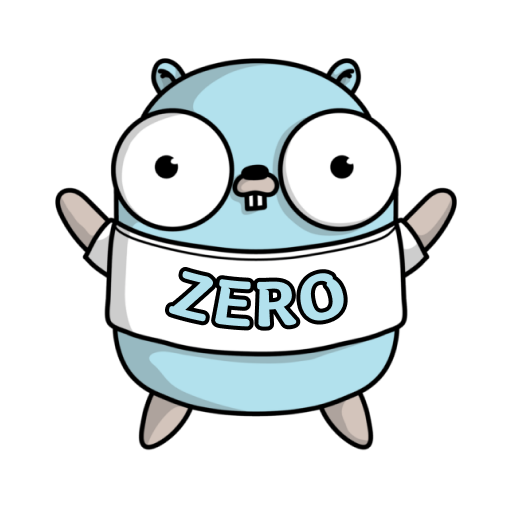
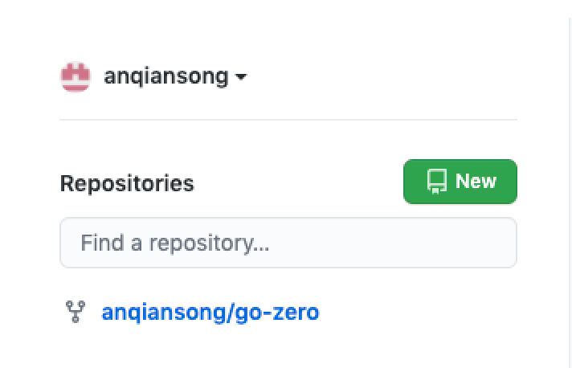
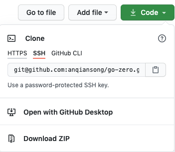
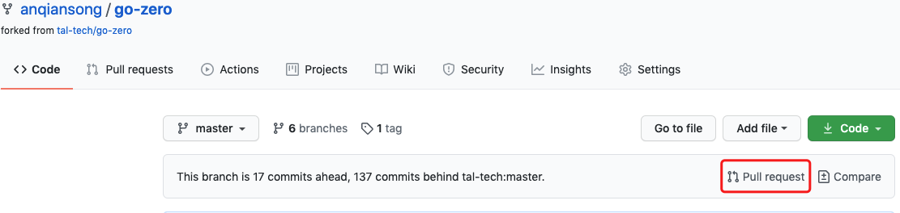
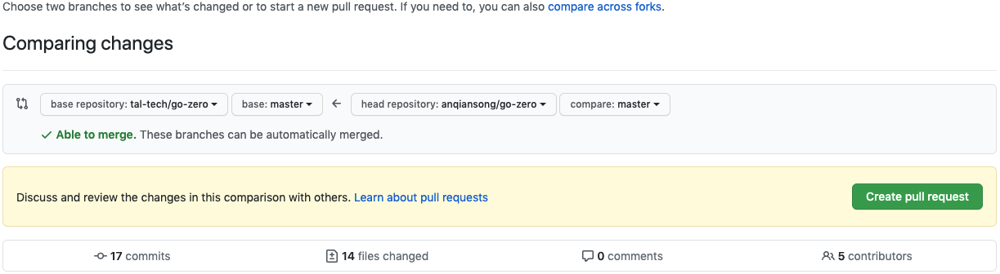
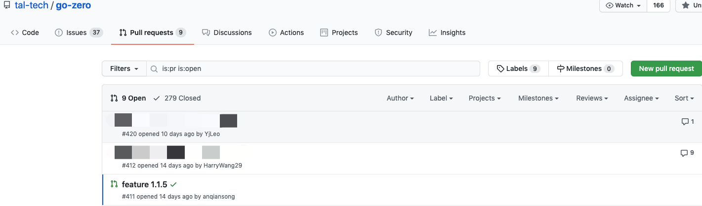

# Join Us
> [!TIP]
> This document is machine-translated by Google. If you find grammatical and semantic errors, and the document description is not clear, please [PR](doc-contibute.md)

## Summary

[go-zero](https://github.com/tal-tech/go-zero) is based on the [MIT License](https://github.com/tal-tech/go-zero/blob/master/LICENSE) open source projects, if you find bugs, new features, etc. in use, you can participate in the contribution of go-zero. We welcome your active participation and will respond to various questions raised by you as soon as possible. , Pr, etc.

## Contribution form
* [Pull Request](https://github.com/tal-tech/go-zero/pulls)
* [Issue](https://github.com/tal-tech/go-zero/issues)

## Contribution notes
The code in go-zero's Pull request needs to meet certain specifications
* For naming conventions, please read [naming conventions](naming-spec.md)
* Mainly English annotations
* Remark the functional characteristics when pr, the description needs to be clear and concise
* Increase unit test coverage to 80%+

## Pull Request（pr）
* Enter [go-zero](https://github.com/tal-tech/go-zero) project, fork a copy of [go-zero](https://github.com/tal-tech/go-zero) Project to its own GitHub repository.
* Go back to your GitHub homepage and find the `xx/go-zero` project, where xx is your username, such as `anqiansong/go-zero`

    
* Clone the code to local

    
* Develop code and push to your own GitHub repository
* Enter the go-zero project in your own GitHub, click on the `[Pull requests]` on the floating layer to enter the Compare page.

    

* `base repository` choose `tal-tech/go-zero` `base:master`,`head repository` choose `xx/go-zero` `compare:$branch` ，`$branch` is the branch you developed, as shown in the figure:

    

* Click `[Create pull request]` to realize the pr application
* To confirm whether the pr submission is successful, enter [Pull requests](https://github.com/tal-tech/go-zero) of [go-zero](https://github.com/tal-tech/go-zero) /pulls) view, there should be a record of your own submission, the name is your branch name during development.

    

## Issue
In our community, many partners will actively feedback some problems encountered during the use of go-zero. 
Due to the large number of people in the community, although we will follow the community dynamics in real time, 
the feedback of all questions is random. When our team is still solving a problem raised by a partner, other issues are also fed back, 
which may cause the team to easily ignore it. In order to solve everyone's problems one by one, we strongly recommend that everyone use the issue method.
Feedback issues, including but not limited to bug, expected new features, etc., we will also reflect in the issue when we implement a certain new feature. 
You can also get the latest trend of go-zero here, and welcome everyone Come and actively participate in the discussion.

### How to issue
* Click [here](https://github.com/tal-tech/go-zero/issues) to enter go-zero's Issue page or directly visit [https://github.com/tal-tech/go-zero/ issues](https://github.com/tal-tech/go-zero/issues) address
* Click `[New issue]` in the upper right corner to create a new issue
* Fill in the issue title and content
* Click `【Submit new issue】` to submit an issue

## Reference

* [Github Pull request](https://docs.github.com/en/github/collaborating-with-issues-and-pull-requests/proposing-changes-to-your-work-with-pull-requests)