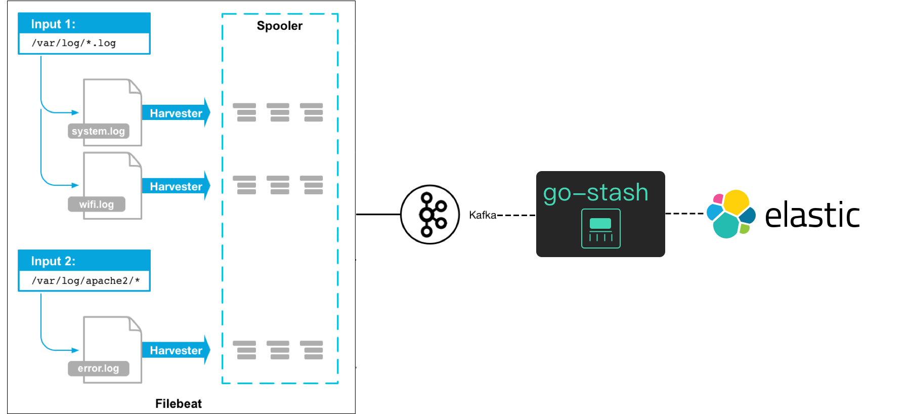

# Log Collection
> [!TIP]
> This document is machine-translated by Google. If you find grammatical and semantic errors, and the document description is not clear, please [PR](doc-contibute.md)

In order to ensure the stable operation of the business and predict the unhealthy risks of the service, the collection of logs can help us observe the current health of the service.
In traditional business development, when there are not many machine deployments, we usually log in directly to the server to view and debug logs. However, as the business increases, services continue to be split.

The maintenance cost of the service will also become more and more complicated. In a distributed system, there are more server machines, and the service is distributed on different servers. When problems are encountered,
We can't use traditional methods to log in to the server for log investigation and debugging. The complexity can be imagined.



> [!TIP]
> If it is a simple single service system, or the service is too small, it is not recommended to use it directly, otherwise it will be counterproductive.

## Prepare
* kafka
* elasticsearch
* kibana
* filebeat、Log-Pilot（k8s）
* go-stash

## Filebeat
```shell
$ vim xx/filebeat.yaml
```

```yaml
filebeat.inputs:
- type: log
  enabled: true
  # Turn on json parsing
  json.keys_under_root: true
  json.add_error_key: true
  # Log file path
  paths:
    - /var/log/order/*.log

setup.template.settings:
  index.number_of_shards: 1

# Define kafka topic field
fields:
  log_topic: log-collection

# Export to kafka
output.kafka:
  hosts: ["127.0.0.1:9092"]
  topic: '%{[fields.log_topic]}'
  partition.round_robin:
    reachable_only: false
  required_acks: 1
  keep_alive: 10s

# ================================= Processors =================================
processors:
  - decode_json_fields:
      fields: ['@timestamp','level','content','trace','span','duration']
      target: ""
```

> [!TIP]
> xx is the path where filebeat.yaml is located

## go-stash configuration
* Create a new `config.yaml` file
* Add configuration content

```shell
$ vim config.yaml
```

```yaml
Clusters:
- Input:
    Kafka:
      Name: go-stash
      Log:
        Mode: file
      Brokers:
      - "127.0.0.1:9092"
      Topics: 
      - log-collection
      Group: stash
      Conns: 3
      Consumers: 10
      Processors: 60
      MinBytes: 1048576
      MaxBytes: 10485760
      Offset: first
  Filters:
  - Action: drop
    Conditions:
      - Key: status
        Value: "503"
        Type: contains
      - Key: type
        Value: "app"
        Type: match
        Op: and
  - Action: remove_field
    Fields:
    - source
    - _score
    - "@metadata"
    - agent
    - ecs
    - input
    - log
    - fields
  Output:
    ElasticSearch:
      Hosts:
      - "http://127.0.0.1:9200"
      Index: "go-stash-{{yyyy.MM.dd}}"
      MaxChunkBytes: 5242880
      GracePeriod: 10s
      Compress: false
      TimeZone: UTC
```

## Start services (start in order)
* Start kafka
* Start elasticsearch
* Start kibana
* Start go-stash
* Start filebeat
* Start the order-api service and its dependent services (order-api service in the go-zero-demo project)

## Visit kibana
Enter 127.0.0.1:5601


> [!TIP]
> Here we only demonstrate the logs generated by logx in the collection service, and log collection in nginx is the same.


# Reference
* [kafka](http://kafka.apache.org/)
* [elasticsearch](https://www.elastic.co/cn/elasticsearch/)
* [kibana](https://www.elastic.co/cn/kibana)
* [filebeat](https://www.elastic.co/cn/beats/filebeat)
* [go-stash](https://github.com/tal-tech/go-stash)
* [filebeat](https://www.elastic.co/guide/en/beats/filebeat/current/index.html)
