# Persistent layer cache
> [!TIP]
> This document is machine-translated by Google. If you find grammatical and semantic errors, and the document description is not clear, please [PR](doc-contibute.md)

## Principles of Cache Design

We only delete the cache without updating it. Once the data in the DB is modified, we will directly delete the corresponding cache instead of updating it.

Let's see how the order of deleting the cache is correct.

* Delete the cache first, then update the DB

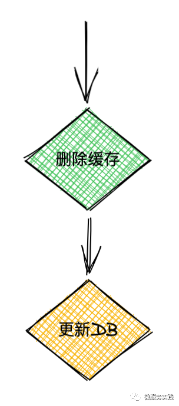

Let's look at the situation of two concurrent requests. A request needs to update the data. The cache is deleted first, and then B requests to read the data. At this time, there is no data in the cache, and the data is loaded from the DB and written back to the cache, and then A updates the DB , Then the data in the cache will always be dirty data at this time, until the cache expires or there is a new data update request. As shown

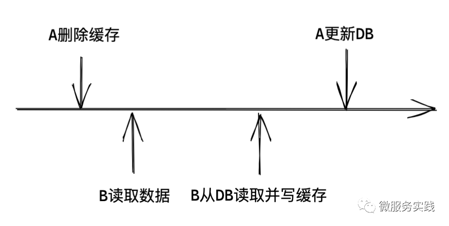

* Update the DB first, then delete the cache

    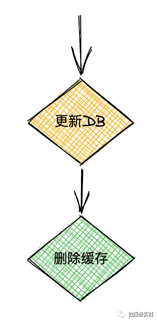

A requests to update the DB first, and then B requests to read the data. At this time, the old data is returned. At this time, it can be considered that the A request has not been updated, and the final consistency is acceptable. Then A deletes the cache, and subsequent requests will Get the latest data, as shown in the figure
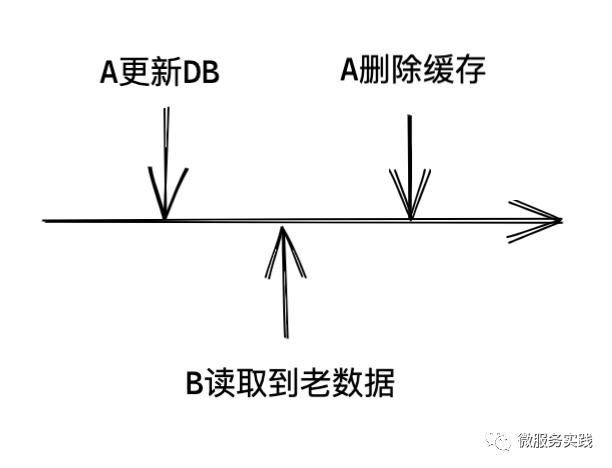

Let's take another look at the normal request flow:

* The first request to update the DB and delete the cache
* The second request to read the cache, if there is no data, read the data from the DB and write it back to the cache
* All subsequent read requests can be read directly from the cache
  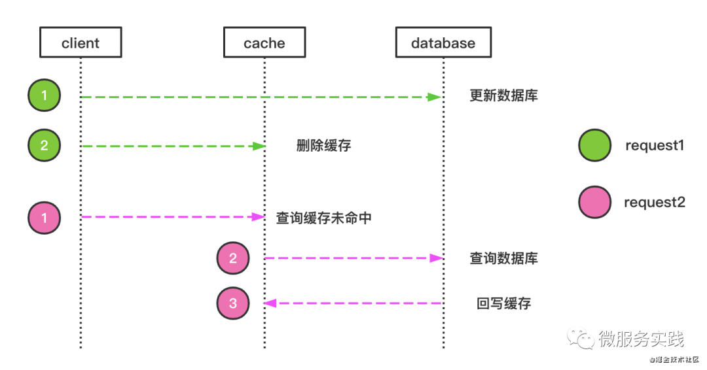

Let's take a look at the DB query, assuming that there are seven columns of ABCDEFG data in the row record:

* A request to query only part of the column data, such as ABC, CDE or EFG in the request, as shown in the figure
  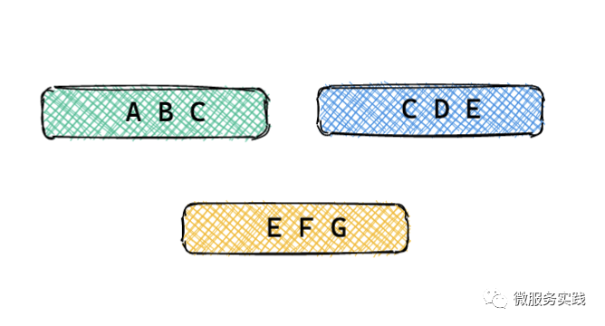
  
* Query a single complete row record, as shown in the figure
  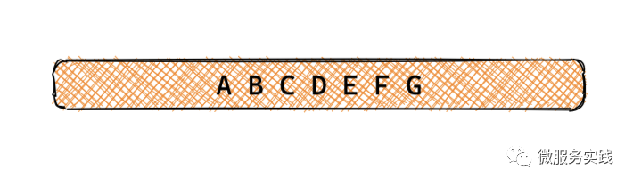
  
* Query part or all of the columns of multiple rows, as shown in the figure
  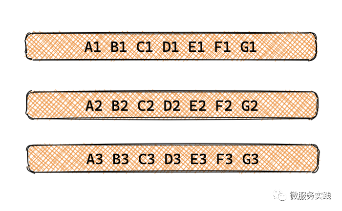

For the above three cases, firstly, we don’t need partial queries, because some queries cannot be cached. Once cached, the data is updated, and it is impossible to locate which data needs to be deleted; secondly, for multi-line queries, according to actual scenarios and If necessary, we will establish the corresponding mapping from the query conditions to the primary key in the business layer; and for the query of a single row of complete records, go-zero has a built-in complete cache management method. So the core principle is: **go-zero cache must be a complete line record**.

Let's introduce in detail the cache processing methods of the three built-in scenarios in go-zero:

* Cache based on primary key
  ```text
  PRIMARY KEY (`id`)
  ```

This kind of cache is relatively the easiest to handle, just use the primary key as the key in redis to cache line records.

* Cache based on unique index
  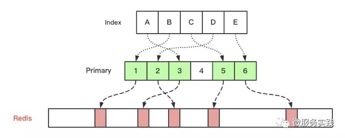

When doing index-based cache design, I used the design method of database index for reference. In database design, if you use the index to check data, the engine will first find the primary key in the tree of index -> primary key, and then use the primary key. To query row records, an indirect layer is introduced to solve the corresponding problem of index to row records. The same principle applies to the cache design of go-zero.

Index-based cache is divided into single-column unique index and multi-column unique index:

But for go-zero, single-column and multi-column are just different ways of generating cache keys, and the control logic behind them is the same. Then go-zero's built-in cache management can better control the data consistency problem, and also built-in to prevent the breakdown, penetration, and avalanche problems of the cache (these were discussed carefully when sharing at the gopherchina conference, see follow-up gopherchina Share video).

In addition, go-zero has built-in cache access and access hit rate statistics, as shown below:

```text
dbcache(sqlc) - qpm: 5057, hit_ratio: 99.7%, hit: 5044, miss: 13, db_fails: 0
```

But for go-zero, single-column and multi-column are just different ways of generating cache keys, and the control logic behind them is the same. Then go-zero's built-in cache management can better control the data consistency problem, and also built-in to prevent the breakdown, penetration, and avalanche problems of the cache (these were discussed carefully when sharing at the gopherchina conference, see follow-up gopherchina Share video).

* The single-column unique index is as follows:
  ```text
  UNIQUE KEY `product_idx` (`product`)
  ```

* The multi-column unique index is as follows:
  ```text
  UNIQUE KEY `vendor_product_idx` (`vendor`, `product`)
  ```
## Cache code interpretation

### 1. Cache logic based on the primary key
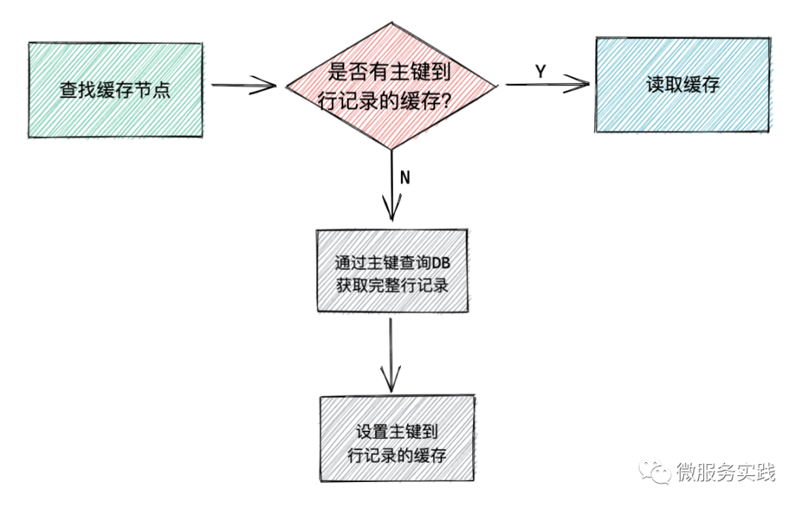

The specific implementation code is as follows:
```go
func (cc CachedConn) QueryRow(v interface{}, key string, query QueryFn) error {
  return cc.cache.Take(v, key, func(v interface{}) error {
    return query(cc.db, v)
  })
}
```

The `Take` method here is to first get the data from the cache via the `key`, if you get it, return it directly, if you can't get it, then use the `query` method to go to the `DB` to read the complete row record and write it back Cache, and then return the data. The whole logic is relatively simple and easy to understand.

Let's take a look at the implementation of `Take` in detail:
```go
func (c cacheNode) Take(v interface{}, key string, query func(v interface{}) error) error {
  return c.doTake(v, key, query, func(v interface{}) error {
    return c.SetCache(key, v)
  })
}
```

The logic of `Take` is as follows:

* Use key to find data from cache
* If found, return the data
* If you can't find it, use the query method to read the data
* After reading it, call c.SetCache(key, v) to set the cache

The code and explanation of `doTake` are as follows:
```go
// v - The data object that needs to be read
// key - Cache key
// query - Method used to read complete data from DB
// cacheVal - Method used to write cache
func (c cacheNode) doTake(v interface{}, key string, query func(v interface{}) error,
  cacheVal func(v interface{}) error) error {
  // Use barriers to prevent cache breakdown and ensure that there is only one request in a process to load the data corresponding to the key
  val, fresh, err := c.barrier.DoEx(key, func() (interface{}, error) {
    // Read data from the cache
    if err := c.doGetCache(key, v); err != nil {
      // If it is a placeholder that was put in beforehand (to prevent cache penetration), then the default errNotFound is returned
      // If it is an unknown error, then return directly, because we can't give up the cache error and directly send all requests to the DB,
      // This will kill the DB in a high concurrency scenario
      if err == errPlaceholder {
        return nil, c.errNotFound
      } else if err != c.errNotFound {
        // why we just return the error instead of query from db,
        // because we don't allow the disaster pass to the DBs.
        // fail fast, in case we bring down the dbs.
        return nil, err
      }

      // request DB
      // If the returned error is errNotFound, then we need to set a placeholder in the cache to prevent the cache from penetrating
      if err = query(v); err == c.errNotFound {
        if err = c.setCacheWithNotFound(key); err != nil {
          logx.Error(err)
        }

        return nil, c.errNotFound
      } else if err != nil {
        // Statistics DB failed
        c.stat.IncrementDbFails()
        return nil, err
      }

      // Write data to cache
      if err = cacheVal(v); err != nil {
        logx.Error(err)
      }
    }
    
    // Return json serialized data
    return jsonx.Marshal(v)
  })
  if err != nil {
    return err
  }
  if fresh {
    return nil
  }

  // got the result from previous ongoing query
  c.stat.IncrementTotal()
  c.stat.IncrementHit()

  // Write data to the incoming v object
  return jsonx.Unmarshal(val.([]byte), v)
}
```

### 2. Cache logic based on unique index
Because this block is more complicated, I used different colors to mark out the code block and logic of the response. `block 2` is actually the same as the cache based on the primary key. Here, I mainly talk about the logic of `block 1`.
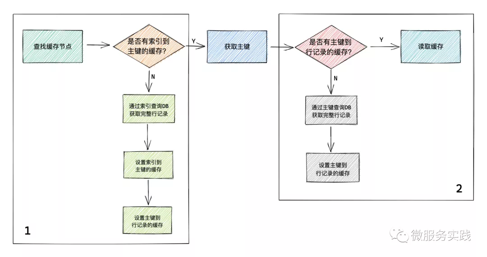

The block 1 part of the code block is divided into two cases:

* The primary key can be found from the cache through the index. At this time, the primary key is used directly to walk the logic of `block 2`, and the follow-up is the same as the above-based primary key-based caching logic.

* The primary key cannot be found in the cache through the index
  * Query the complete row record from the DB through the index, if there is an error, return
  * After the complete row record is found, the cache of the primary key to the complete row record and the cache of the index to the primary key will be written to `redis` at the same time
  * Return the required row data
  
```go
// v-the data object that needs to be read
// key-cache key generated by index
// keyer-Use the primary key to generate a key based on the primary key cache
// indexQuery-method to read complete data from DB using index, need to return the primary key
// primaryQuery-method to get complete data from DB with primary key
func (cc CachedConn) QueryRowIndex(v interface{}, key string, keyer func(primary interface{}) string,
  indexQuery IndexQueryFn, primaryQuery PrimaryQueryFn) error {
  var primaryKey interface{}
  var found bool

  // First query the cache through the index to see if there is a cache from the index to the primary key
  if err := cc.cache.TakeWithExpire(&primaryKey, key, func(val interface{}, expire time.Duration) (err error) {
    // If there is no cache of the index to the primary key, then the complete data is queried through the index
    primaryKey, err = indexQuery(cc.db, v)
    if err != nil {
      return
    }

    // The complete data is queried through the index, set to “found” and used directly later, no need to read data from the cache anymore
    found = true
    // Save the mapping from the primary key to the complete data in the cache. The TakeWithExpire method has saved the mapping from the index to the primary key in the cache.
    return cc.cache.SetCacheWithExpire(keyer(primaryKey), v, expire+cacheSafeGapBetweenIndexAndPrimary)
  }); err != nil {
    return err
  }

  // The data has been found through the index, just return directly
  if found {
    return nil
  }

  // Read data from the cache through the primary key, if the cache is not available, read from the DB through the primaryQuery method and write back to the cache and then return the data
  return cc.cache.Take(v, keyer(primaryKey), func(v interface{}) error {
    return primaryQuery(cc.db, v, primaryKey)
  })
}
```

Let's look at a practical example
```go
func (m *defaultUserModel) FindOneByUser(user string) (*User, error) {
  var resp User
  // Generate index-based keys
  indexKey := fmt.Sprintf("%s%v", cacheUserPrefix, user)
  
  err := m.QueryRowIndex(&resp, indexKey,
    // Generate a complete data cache key based on the primary key
    func(primary interface{}) string {
      return fmt.Sprintf("user#%v", primary)
    },
    // Index-based DB query method
    func(conn sqlx.SqlConn, v interface{}) (i interface{}, e error) {
      query := fmt.Sprintf("select %s from %s where user = ? limit 1", userRows, m.table)
      if err := conn.QueryRow(&resp, query, user); err != nil {
        return nil, err
      }
      return resp.Id, nil
    },
    // DB query method based on primary key
    func(conn sqlx.SqlConn, v, primary interface{}) error {
      query := fmt.Sprintf("select %s from %s where id = ?", userRows, m.table)
      return conn.QueryRow(&resp, query, primary)
    })

 // Error handling, you need to determine whether the returned sqlc.ErrNotFound is, if it is, we use the ErrNotFound defined in this package to return
 // Prevent users from perceiving whether or not the cache is used, and at the same time isolate the underlying dependencies
  switch err {
    case nil:
      return &resp, nil
    case sqlc.ErrNotFound:
      return nil, ErrNotFound
    default:
      return nil, err
  }
}
```

All the above cache automatic management codes can be automatically generated through [goctl](goctl.md), and the internal `CRUD` and cache of our team are basically automatically generated through [goctl](goctl.md), which can save A lot of development time, and the cache code itself is also very error-prone. Even with good code experience, it is difficult to write it correctly every time. Therefore, we recommend using automatic cache code generation tools as much as possible to avoid errors.

# Guess you wants
* [The fourth phase-how to design go-zero cache in OpenTalk](https://www.bilibili.com/video/BV1Jy4y127Xu)
* [Goctl](goctl.md)