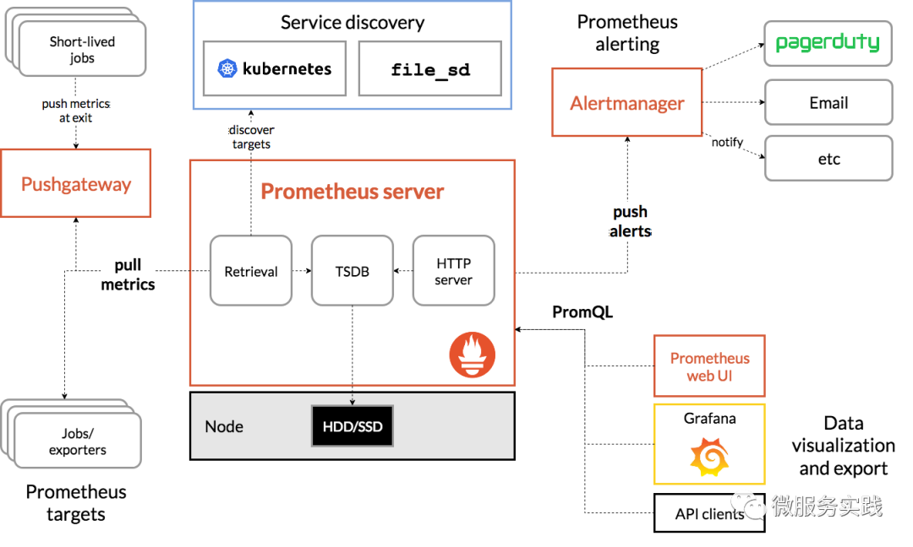
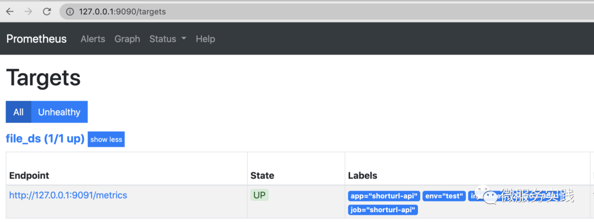
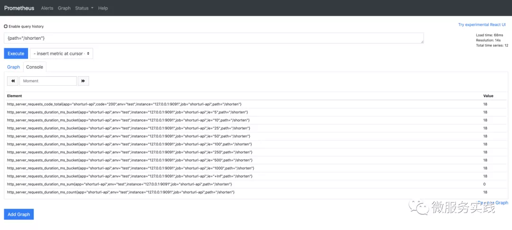
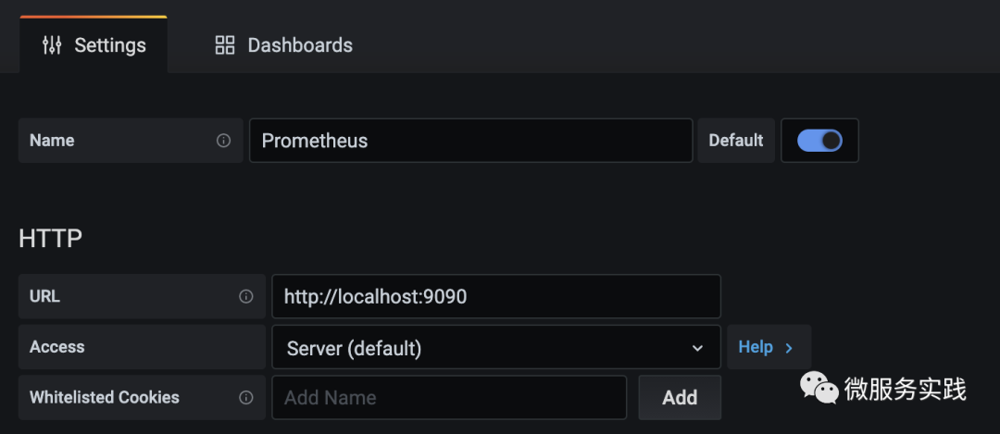
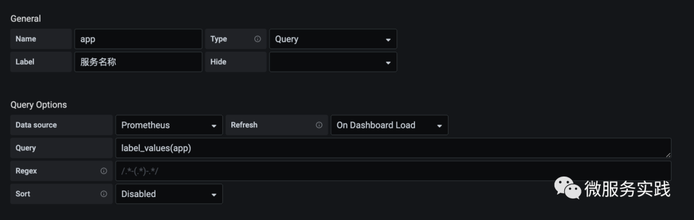
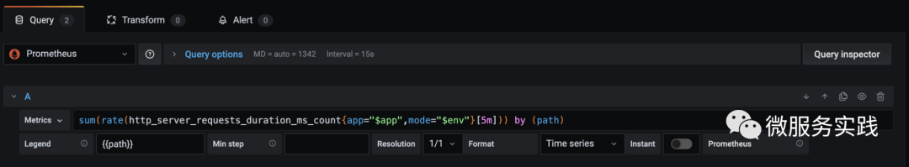
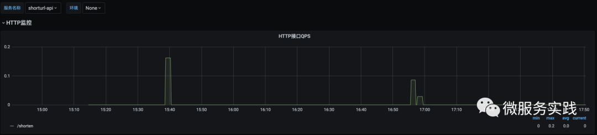

# Monitor
> [!TIP]
> This document is machine-translated by Google. If you find grammatical and semantic errors, and the document description is not clear, please [PR](doc-contibute.md)

In microservice governance, service monitoring is also a very important link. Monitoring whether a service is working normally needs to be carried out from multiple dimensions, such as:* mysql indicators
* mongo indicators
* redis indicator
* Request log
* Service index statistics
* Service health check
...

The monitoring work is very large, and this section only uses the `service indicator monitoring` as an example for illustration.

## Microservice indicator monitoring based on prometheus

After the service is online, we often need to monitor the service so that we can find the problem early and make targeted optimization. The monitoring can be divided into various forms, such as log monitoring, call chain monitoring, indicator monitoring, and so on. Through indicator monitoring, the changing trend of service indicators can be clearly observed, and the operating status of the service can be understood, which plays a very important role in ensuring the stability of the service.

Prometheus is an open source system monitoring and warning tool that supports a powerful query language, PromQL, allowing users to select and aggregate time series data in real time. Time series data is actively pulled by the server through the HTTP protocol, or it can be pushed through an intermediate gateway. Data, you can obtain monitoring targets through static configuration files or service discovery

## Prometheus architecture

The overall architecture and ecosystem components of Prometheus are shown in the following figure:


Prometheus Server pulls monitoring indicators directly from the monitoring target or indirectly through the push gateway. It stores all captured sample data locally and executes a series of rules on this data to summarize and record new time series or existing data. Generate an alert. The monitoring data can be visualized through Grafana or other tools

## go-zero service indicator monitoring based on prometheus

The go-zero framework integrates prometheus-based service indicator monitoring. Below we use go-zero’s official example short url to demonstrate how to collect and monitor service indicators:
* The first step is to install Prometheus first, please refer to the official documentation for the installation steps
* go-zero does not enable prometheus monitoring by default. The opening method is very simple. You only need to add the following configuration to the shorturl-api.yaml file, where Host is the Prometheus Server address, which is a required configuration, the Port port is not filled in and the default is 9091, and the Path is used The path to pull metrics is /metrics by default
    ```yaml
    Prometheus:
      Host: 127.0.0.1
      Port: 9091
      Path: /metrics
    ```

* Edit the prometheus configuration file prometheus.yml, add the following configuration, and create targets.json
    ```yaml
    - job_name: 'file_ds'
      file_sd_configs:
      - files:
        - targets.json
    ```
* Edit the targets.json file, where targets is the target address configured by shorturl, and add several default tags
    ```yaml
    [
        {
            "targets": ["127.0.0.1:9091"],
            "labels": {
                "job": "shorturl-api",
                "app": "shorturl-api",
                "env": "test",
                "instance": "127.0.0.1:8888"
            }
        }
    ]
    ```
* Start the prometheus service, listening on port 9090 by default
    ```shell
    $ prometheus --config.file=prometheus.yml
    ```
* Enter `http://127.0.0.1:9090/` in the browser, and then click `Status` -> `Targets` to see the job whose status is Up, and the default label we configured can be seen in the Labels column

  Through the above steps, we have completed the configuration work of Prometheus for the indicator monitoring collection of the shorturl service. For the sake of simplicity, we have performed manual configuration. In the actual production environment, we generally use the method of regularly updating configuration files or service discovery to configure monitoring. Goals, space is limited, not explained here, interested students please check the relevant documents on their own

## Types of indicators monitored by go-zero

go-zero currently adds monitoring of request metrics to the http middleware and rpc interceptor.

Mainly from the two dimensions of request time and request error. The request time uses the Histogram metric type to define multiple Buckets to facilitate quantile statistics. The request error uses the Counter type, and the path tag rpc metric is added to the http metric. Added the method tag for detailed monitoring.
Next, demonstrate how to view monitoring indicators:

First execute the following command multiple times on the command line

```shell
$ curl -i "http://localhost:8888/shorten?url=http://www.xiaoheiban.cn"
```
Open Prometheus and switch to the Graph interface, and enter the {path="/shorten"} command in the input box to view the monitoring indicators, as shown below:


We use PromQL grammar query to filter the indicators whose path is /shorten, and the results show the indicator name and indicator value. The code value in the http_server_requests_code_total indicator is the status code of http, 200 indicates that the request is successful, and http_server_requests_duration_ms_bucket separately counts the results of different buckets. , You can also see that all the indicators have added the default indicators we configured
The Console interface mainly displays the index results of the query. The Graph interface provides us with a simple graphical display interface. In the actual production environment, we generally use Grafana for graphical display.

## grafana dashboard

Grafana is a visualization tool with powerful functions and supports multiple data sources such as Prometheus, Elasticsearch, Graphite, etc. For simple installation, please refer to the official documentation. The default port of grafana is 3000. After installation, enter http://localhost:3000/ in the browser. , The default account and password are both admin.

The following demonstrates how to draw the visual interface based on the above indicators:
Click on the left sidebar `Configuration`->`Data Source`->`Add data source` to add a data source, where the HTTP URL is the address of the data source


Click on the left sidebar to add dashboard, and then add Variables to facilitate filtering for different tags, such as adding app variables to filter different services


Enter the dashboard and click Add panel in the upper right corner to add a panel to count the qps of the interface in the path dimension


The final effect is shown below. Different services can be filtered by service name. The panel shows the trend of qps with path /shorten.


# Summary

The above demonstrates the simple process of go-zero based on prometheus+grafana service indicator monitoring. In the production environment, different dimensions of monitoring and analysis can be done according to the actual scenario. Now go-zero's monitoring indicators are mainly for http and rpc, which is obviously insufficient for the overall monitoring of the service, such as the monitoring of container resources, the monitoring of dependent mysql, redis and other resources, and the monitoring of custom indicators, etc. Go-zero will continue to optimize in this regard. Hope this article can help you