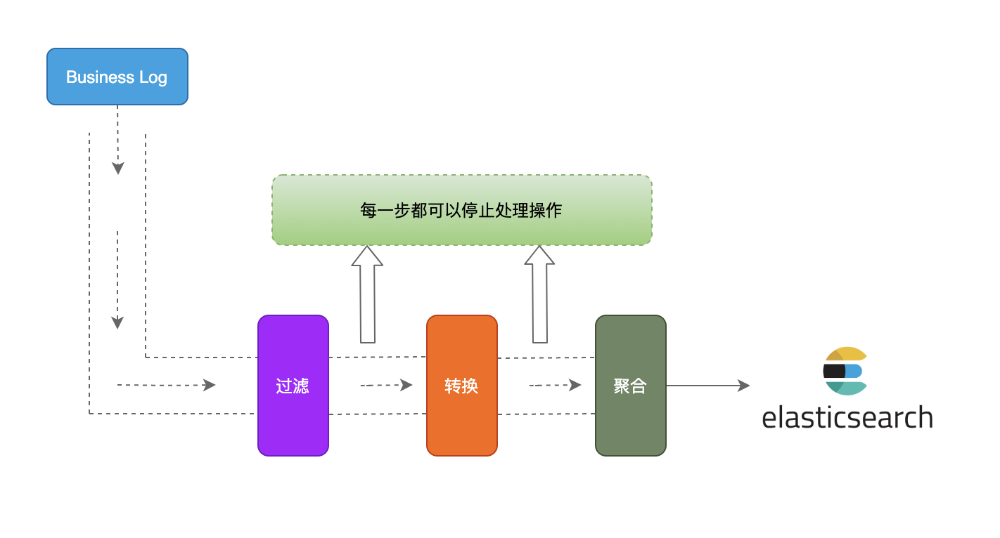
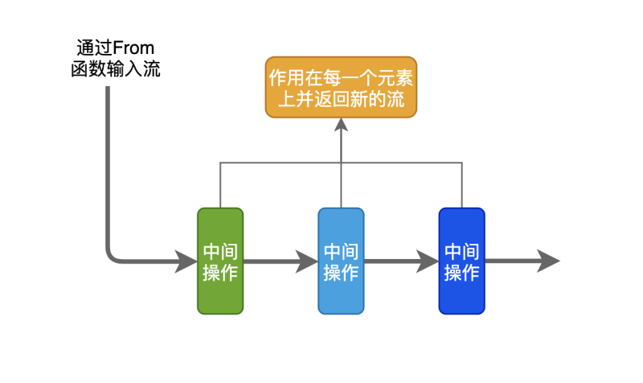
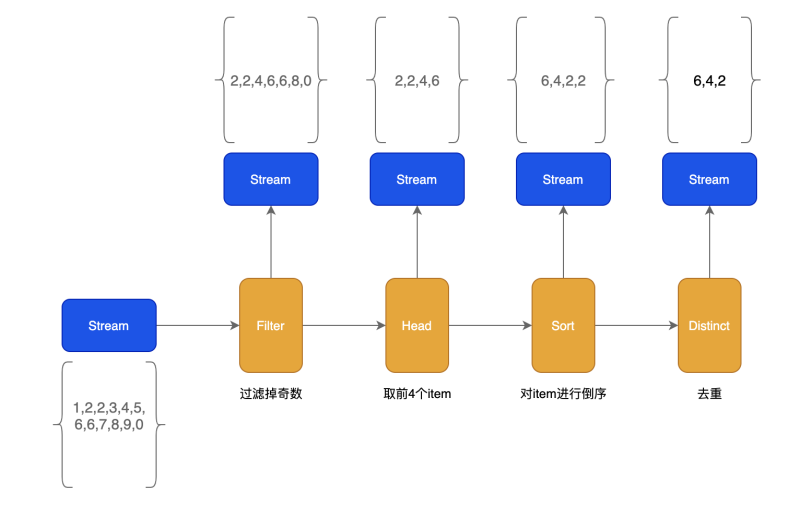
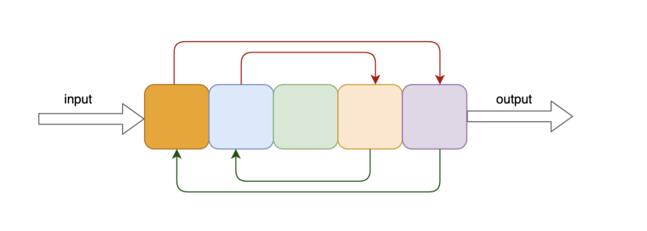
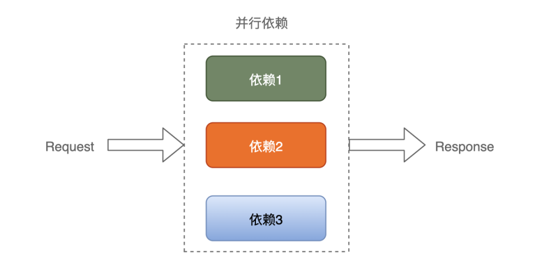

# Stream processing
> [!TIP]
> This document is machine-translated by Google. If you find grammatical and semantic errors, and the document description is not clear, please [PR](doc-contibute.md)

Stream processing is a computer programming paradigm that allows given a data sequence (stream processing data source), a series of data operations (functions) are applied to each element in the stream. At the same time, stream processing tools can significantly improve programmers' development efficiency, allowing them to write effective, clean, and concise code.

Streaming data processing is very common in our daily work. For example, we often record many business logs in business development. These logs are usually sent to Kafka first, and then written to elasticsearch by the Job consumption Kafka, and the logs are in progress. In the process of stream processing, logs are often processed, such as filtering invalid logs, doing some calculations and recombining logs, etc. The schematic diagram is as follows:

### fx
[go-zero](https://github.com/tal-tech/go-zero) is a full-featured microservice framework. There are many very useful tools built in the framework, including streaming data processing tools [fx ](https://github.com/tal-tech/go-zero/tree/master/core/fx), let’s use a simple example to understand the tool:
```go
package main

import (
	"fmt"
	"os"
	"os/signal"
	"syscall"
	"time"

	"github.com/tal-tech/go-zero/core/fx"
)

func main() {
	ch := make(chan int)

	go inputStream(ch)
	go outputStream(ch)

	c := make(chan os.Signal, 1)
	signal.Notify(c, syscall.SIGTERM, syscall.SIGINT)
	<-c
}

func inputStream(ch chan int) {
	count := 0
	for {
		ch <- count
		time.Sleep(time.Millisecond * 500)
		count++
	}
}

func outputStream(ch chan int) {
	fx.From(func(source chan<- interface{}) {
		for c := range ch {
			source <- c
		}
	}).Walk(func(item interface{}, pipe chan<- interface{}) {
		count := item.(int)
		pipe <- count
	}).Filter(func(item interface{}) bool {
		itemInt := item.(int)
		if itemInt%2 == 0 {
			return true
		}
		return false
	}).ForEach(func(item interface{}) {
		fmt.Println(item)
	})
}
```


The inputStream function simulates the generation of stream data, and the outputStream function simulates the process of stream data. The From function is the input of the stream. The Walk function concurrently acts on each item. The Filter function filters the item as true and keeps it as false. Keep, the ForEach function traverses and outputs each item element.


### Intermediate operations of streaming data processing


There may be many intermediate operations in the data processing of a stream, and each intermediate operation can act on the stream. Just like the workers on the assembly line, each worker will return to the processed new part after operating the part, and in the same way, after the intermediate operation of the flow processing is completed, it will also return to a new flow.

Intermediate operations of fx stream processing:

| Operation function | Features | Input |
| --- | --- | --- |
| Distinct | Remove duplicate items | KeyFunc, return the key that needs to be deduplicated |
| Filter | Filter items that do not meet the conditions | FilterFunc, Option controls the amount of concurrency |
| Group | Group items | KeyFunc, group by key |
| Head | Take out the first n items and return to the new stream | int64 reserved number |
| Map | Object conversion | MapFunc, Option controls the amount of concurrency |
| Merge | Merge item into slice and generate new stream |  |
| Reverse | Reverse item |  |
| Sort | Sort items | LessFunc implements sorting algorithm |
| Tail | Similar to the Head function, n items form a new stream after being taken out | int64 reserved number |
| Walk | Act on each item | WalkFunc, Option controls the amount of concurrency |


The following figure shows each step and the result of each step:





### Usage and principle analysis


#### From


Construct a stream through the From function and return the Stream, and the stream data is stored through the channel:


```go
// Example
s := []int{1, 2, 3, 4, 5, 6, 7, 8, 9, 0}
fx.From(func(source chan<- interface{}) {
  for _, v := range s {
    source <- v
  }
})

// Source Code
func From(generate GenerateFunc) Stream {
	source := make(chan interface{})

	threading.GoSafe(func() {
		defer close(source)
		generate(source)
	})

	return Range(source)
}
```


#### Filter


The Filter function provides the function of filtering items, FilterFunc defines the filtering logic true to retain the item, and false to not retain:


```go
// Example: Keep even numbers
s := []int{1, 2, 3, 4, 5, 6, 7, 8, 9, 0}
fx.From(func(source chan<- interface{}) {
  for _, v := range s {
    source <- v
  }
}).Filter(func(item interface{}) bool {
  if item.(int)%2 == 0 {
    return true
  }
  return false
})

// Source Code
func (p Stream) Filter(fn FilterFunc, opts ...Option) Stream {
	return p.Walk(func(item interface{}, pipe chan<- interface{}) {
    // Execute the filter function true to retain, false to discard
		if fn(item) {
			pipe <- item
		}
	}, opts...)
}
```


#### Group


Group groups the stream data. The key of the group needs to be defined. After the data is grouped, it is stored in the channel as slices:


```go
// Example Group according to the first character "g" or "p", if not, it will be divided into another group
	ss := []string{"golang", "google", "php", "python", "java", "c++"}
	fx.From(func(source chan<- interface{}) {
		for _, s := range ss {
			source <- s
		}
	}).Group(func(item interface{}) interface{} {
		if strings.HasPrefix(item.(string), "g") {
			return "g"
		} else if strings.HasPrefix(item.(string), "p") {
			return "p"
		}
		return ""
	}).ForEach(func(item interface{}) {
		fmt.Println(item)
	})
}

// Source Code
func (p Stream) Group(fn KeyFunc) Stream {
  // Define group storage map
	groups := make(map[interface{}][]interface{})
	for item := range p.source {
    // User-defined group key
		key := fn(item)
    // Group the same key into a group
		groups[key] = append(groups[key], item)
	}

	source := make(chan interface{})
	go func() {
		for _, group := range groups {
      // A group of data with the same key is written to the channel
			source <- group
		}
		close(source)
	}()

	return Range(source)
}
```


#### Reverse


reverse can reverse the elements in the stream:





```go
// Example
fx.Just(1, 2, 3, 4, 5).Reverse().ForEach(func(item interface{}) {
  fmt.Println(item)
})

// Source Code
func (p Stream) Reverse() Stream {
	var items []interface{}
  // Get the data in the stream
	for item := range p.source {
		items = append(items, item)
	}
	// Reversal algorithm
	for i := len(items)/2 - 1; i >= 0; i-- {
		opp := len(items) - 1 - i
		items[i], items[opp] = items[opp], items[i]
	}
	
  // Write stream
	return Just(items...)
}
```


#### Distinct


Distinct de-duplicates elements in the stream. De-duplication is commonly used in business development. It is often necessary to de-duplicate user IDs, etc.:


```go
// Example
fx.Just(1, 2, 2, 2, 3, 3, 4, 5, 6).Distinct(func(item interface{}) interface{} {
  return item
}).ForEach(func(item interface{}) {
  fmt.Println(item)
})
// Output: 1，2，3，4，5，6

// Source Code
func (p Stream) Distinct(fn KeyFunc) Stream {
	source := make(chan interface{})

	threading.GoSafe(func() {
		defer close(source)
		// Deduplication is performed by key, and only one of the same key is kept
		keys := make(map[interface{}]lang.PlaceholderType)
		for item := range p.source {
			key := fn(item)
      // The key is not retained if it exists
			if _, ok := keys[key]; !ok {
				source <- item
				keys[key] = lang.Placeholder
			}
		}
	})

	return Range(source)
}
```


#### Walk


The concurrency of the Walk function works on each item in the stream. You can set the number of concurrency through WithWorkers. The default number of concurrency is 16, and the minimum number of concurrency is 1. If you set unlimitedWorkers to true, the number of concurrency is unlimited, but the number of concurrent writes in the stream is unlimited. The data is limited by defaultWorkers. In WalkFunc, users can customize the elements that are subsequently written to the stream, and can write multiple elements without writing:


```go
// Example
fx.Just("aaa", "bbb", "ccc").Walk(func(item interface{}, pipe chan<- interface{}) {
  newItem := strings.ToUpper(item.(string))
  pipe <- newItem
}).ForEach(func(item interface{}) {
  fmt.Println(item)
})

// Source Code
func (p Stream) walkLimited(fn WalkFunc, option *rxOptions) Stream {
	pipe := make(chan interface{}, option.workers)

	go func() {
		var wg sync.WaitGroup
		pool := make(chan lang.PlaceholderType, option.workers)

		for {
      // Control the number of concurrent
			pool <- lang.Placeholder
			item, ok := <-p.source
			if !ok {
				<-pool
				break
			}

			wg.Add(1)
			go func() {
				defer func() {
					wg.Done()
					<-pool
				}()
				// Acting on every element
				fn(item, pipe)
			}()
		}

    // Wait for processing to complete
		wg.Wait()
		close(pipe)
	}()

	return Range(pipe)
}
```


### Concurrent processing


In addition to stream data processing, the fx tool also provides function concurrency. The realization of a function in microservices often requires multiple services. Concurrent processing dependence can effectively reduce dependency time and improve service performance.





```go
fx.Parallel(func() {
  userRPC() 
}, func() {
  accountRPC() 
}, func() {
  orderRPC() 
})
```


Note that when fx.Parallel performs dependency parallel processing, there will be no error return. If you need an error return, or a dependency error report needs to end the dependency request immediately, please use the [MapReduce](https://gocn.vip/topics/10941) tool To process.


### Summary


This article introduces the basic concepts of stream processing and the stream processing tool fx in go-zero. There are many stream processing scenarios in actual production. I hope this article can give you some inspiration and better response Stream processing scene at work.


