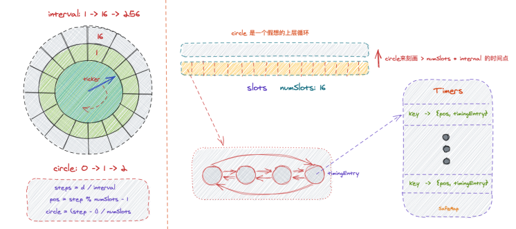
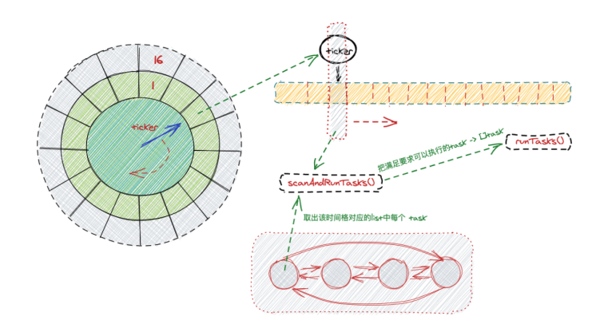

# TimingWheel
> [!TIP]
> This document is machine-translated by Google. If you find grammatical and semantic errors, and the document description is not clear, please [PR](doc-contibute.md)

This article introduces the **delayed operation** in `go-zero`. **Delayed operation**, two options can be used:


1. `Timer`: The timer maintains a priority queue, executes it at the time, and then stores the tasks that need to be executed in the map
2. The `timingWheel` in `collection` maintains an array for storing task groups, and each slot maintains a doubly linked list of tasks. When the execution starts, the timer executes the tasks in a slot every specified time.


Scheme 2 reduces the maintenance task from the `priority queue O(nlog(n))` to the `doubly linked list O(1)`, and the execution of the task only needs to poll the tasks `O(N)` at a time point. Priority queue, put and delete elements `O(nlog(n))`.


## timingWheel in cache


First, let's first talk about the use of TimingWheel in the cache of collection:


```go
timingWheel, err := NewTimingWheel(time.Second, slots, func(k, v interface{}) {
  key, ok := k.(string)
  if !ok {
    return
  }
  cache.Del(key)
})
if err != nil {
  return nil, err
}

cache.timingWheel = timingWheel
```


This is the initialization of `cache` and the initialization of `timingWheel` at the same time for key expiration processing. The parameters in turn represent:


- `interval`: Time division scale
- `numSlots`: time slots
- `execute`: execute a function at a point in time


The function executed in the `cache` is to **delete the expired key**, and this expiration is controlled by the `timingWheel` to advance the time.


**Next, let's learn about it through the use of timingWheel by cache. **


### Initialization


```go
func newTimingWheelWithClock(interval time.Duration, numSlots int, execute Execute, ticker timex.Ticker) (
	*TimingWheel, error) {
	tw := &TimingWheel{
		interval:      interval,                     // Single time grid time interval
		ticker:        ticker,                       // Timer, do time push, advance by interval
		slots:         make([]*list.List, numSlots), // Time wheel
		timers:        NewSafeMap(),                 // Store the map of task{key, value} [parameters needed to execute execute]
		tickedPos:     numSlots - 1,                 // at previous virtual circle
		execute:       execute,                      // Execution function
		numSlots:      numSlots,                     // Initialize slots num
		setChannel:    make(chan timingEntry),       // The following channels are used for task delivery
		moveChannel:   make(chan baseEntry),
		removeChannel: make(chan interface{}),
		drainChannel:  make(chan func(key, value interface{})),
		stopChannel:   make(chan lang.PlaceholderType),
	}
	// Prepare all the lists stored in the slot
	tw.initSlots()
	// Open asynchronous coroutine, use channel for task communication and delivery
	go tw.run()

	return tw, nil
}
```





The above is a more intuitive display of the **"time wheel"** of the `timingWheel`, and the details of the advancement will be explained later around this picture.


`go tw.run()` opens a coroutine for time promotion:


```go
func (tw *TimingWheel) run() {
	for {
		select {
      // Timer do time push -> scanAndRunTasks()
		case <-tw.ticker.Chan():
			tw.onTick()
      // add task will enter task into setChannel
		case task := <-tw.setChannel:
			tw.setTask(&task)
		...
		}
	}
}
```


It can be seen that the `timer` execution is started at the time of initialization, and it is rotated in the `internal` time period, and then the bottom layer keeps getting the tasks from the `list` in the `slot` and handing them over to the `execute` for execution.





### Task Operation


The next step is to set the `cache key`:


```go
func (c *Cache) Set(key string, value interface{}) {
	c.lock.Lock()
	_, ok := c.data[key]
	c.data[key] = value
	c.lruCache.add(key)
	c.lock.Unlock()

	expiry := c.unstableExpiry.AroundDuration(c.expire)
	if ok {
		c.timingWheel.MoveTimer(key, expiry)
	} else {
		c.timingWheel.SetTimer(key, value, expiry)
	}
}
```


1. First look at whether this key exists in the `data map`
1. If it exists, update `expire` -> `MoveTimer()`
1. Set the key for the first time -> `SetTimer()`


So the use of `timingWheel` is clear. Developers can `add` or `update` according to their needs.


At the same time, when we follow the source code, we will find that: `SetTimer() MoveTimer()` all transports tasks to channel, and the coroutine opened in `run()` continuously takes out the task operations of `channel`.


> `SetTimer() -> setTask()`：
> - not exist task：`getPostion -> pushBack to list -> setPosition`
> - exist task：`get from timers -> moveTask()`
>
`MoveTimer() -> moveTask()`


From the above call chain, there is a function that will be called: `moveTask()`


```go
func (tw *TimingWheel) moveTask(task baseEntry) {
	// timers: Map => Get [positionEntry「pos, task」] by key
	val, ok := tw.timers.Get(task.key)
	if !ok {
		return
	}

	timer := val.(*positionEntry)
  // {delay <interval} => The delay time is less than a time grid interval, and there is no smaller scale, indicating that the task should be executed immediately
	if task.delay < tw.interval {
		threading.GoSafe(func() {
			tw.execute(timer.item.key, timer.item.value)
		})
		return
	}
	// If> interval, the new pos, circle in the time wheel is calculated by the delay time delay
	pos, circle := tw.getPositionAndCircle(task.delay)
	if pos >= timer.pos {
		timer.item.circle = circle
    // Move offset before and after recording. To re-enter the team for later process
		timer.item.diff = pos - timer.pos
	} else if circle > 0 {
		// Move to the next layer and convert circle to part of diff
		circle--
		timer.item.circle = circle
		// Because it is an array, add numSlots [that is equivalent to going to the next level]
		timer.item.diff = tw.numSlots + pos - timer.pos
	} else {
		// If the offset is advanced, the task is still in the first layer at this time
		// Mark to delete the old task, and re-enter the team, waiting to be executed
		timer.item.removed = true
		newItem := &timingEntry{
			baseEntry: task,
			value:     timer.item.value,
		}
		tw.slots[pos].PushBack(newItem)
		tw.setTimerPosition(pos, newItem)
	}
}
```


The above process has the following situations:


- `delay <internal`: Because <single time precision, it means that this task has expired and needs to be executed immediately
- For changed `delay`:
    - `new >= old`：`<newPos, newCircle, diff>`
    - `newCircle> 0`: Calculate diff and convert circle to the next layer, so diff + numslots
    - If only the delay time is shortened, delete the old task mark, re-add it to the list, and wait for the next loop to be executed


### Execute


In the previous initialization, the timer in `run()` kept advancing, and the process of advancing was mainly to pass the tasks in the list to the executed `execute func`. Let's start with the execution of the timer:


```go
// Timer "It will be executed every internal"
func (tw *TimingWheel) onTick() {
  // Update the current execution tick position every time it is executed
	tw.tickedPos = (tw.tickedPos + 1) % tw.numSlots
  // Get the doubly linked list of stored tasks in the tick position at this time
	l := tw.slots[tw.tickedPos]
	tw.scanAndRunTasks(l)
}
```


Next is how to execute `execute`:


```go
func (tw *TimingWheel) scanAndRunTasks(l *list.List) {
	// Store the task{key, value} that needs to be executed at present [parameters required by execute, which are passed to execute in turn]
	var tasks []timingTask

	for e := l.Front(); e != nil; {
		task := e.Value.(*timingEntry)
    // Mark the deletion, do the real deletion in scan "Delete the map data"
		if task.removed {
			next := e.Next()
			l.Remove(e)
			tw.timers.Del(task.key)
			e = next
			continue
		} else if task.circle > 0 {
			// The current execution point has expired, but it is not at the first level at the same time, so now that the current level has been completed, it will drop to the next level
            // But did not modify pos
			task.circle--
			e = e.Next()
			continue
		} else if task.diff > 0 {
			// Because the diff has been marked before, you need to enter the queue again
			next := e.Next()
			l.Remove(e)
			pos := (tw.tickedPos + task.diff) % tw.numSlots
			tw.slots[pos].PushBack(task)
			tw.setTimerPosition(pos, task)
			task.diff = 0
			e = next
			continue
		}
		// The above cases are all cases that cannot be executed, and those that can be executed will be added to tasks
		tasks = append(tasks, timingTask{
			key:   task.key,
			value: task.value,
		})
		next := e.Next()
		l.Remove(e)
		tw.timers.Del(task.key)
		e = next
	}
	// for range tasks, and then execute each task->execute
	tw.runTasks(tasks)
}
```


The specific branching situation is explained in the comments. When you look at it, it can be combined with the previous `moveTask()`, where the `circle` drops, and the calculation of `diff` is the key to linking the two functions.


As for the calculation of `diff`, the calculation of `pos, circle` is involved:


```go
// interval: 4min, d: 60min, numSlots: 16, tickedPos = 15
// step = 15, pos = 14, circle = 0
func (tw *TimingWheel) getPositionAndCircle(d time.Duration) (pos int, circle int) {
	steps := int(d / tw.interval)
	pos = (tw.tickedPos + steps) % tw.numSlots
	circle = (steps - 1) / tw.numSlots
	return
}
```


The above process can be simplified to the following:
 
```go
steps = d / interval
pos = step % numSlots - 1
circle = (step - 1) / numSlots
```


## Summary


The `timingWheel` is driven by the timer. As the time advances, the tasks of the `list` "doubly linked list" in the **current time grid** will be taken out and passed to the `execute` for execution.


In terms of time separation, the time wheel has `circle` layers, so that the original `numSlots` can be reused continuously, because the timer is constantly `loop`, and execution can drop the upper layer `slot` to the lower layer. You can execute the task up to the upper level continuously in the `loop`.


There are many useful component tools in `go-zero`. Good use of tools is of great help to improve service performance and development efficiency. I hope this article can bring you some gains.
