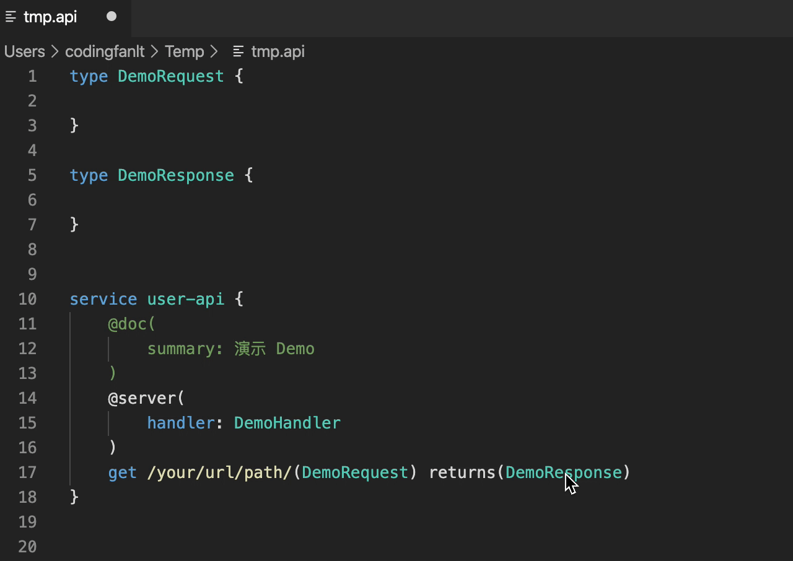
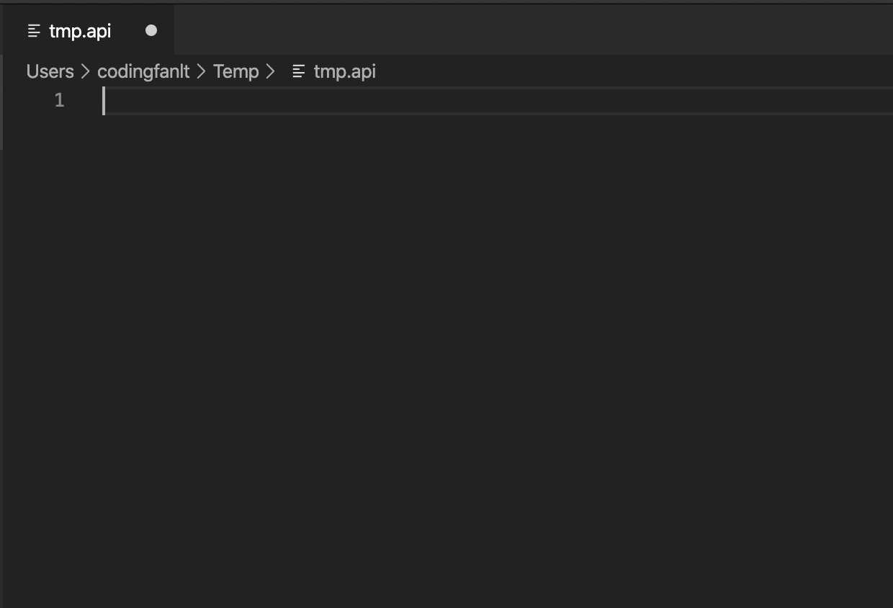
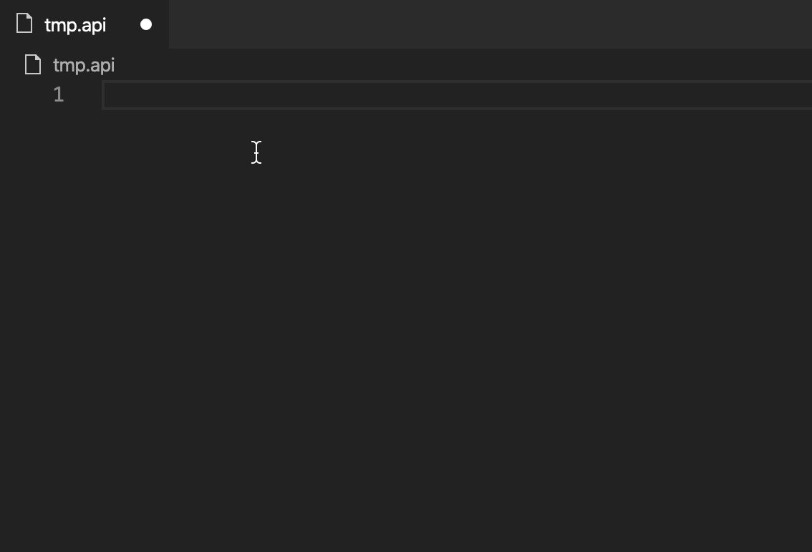
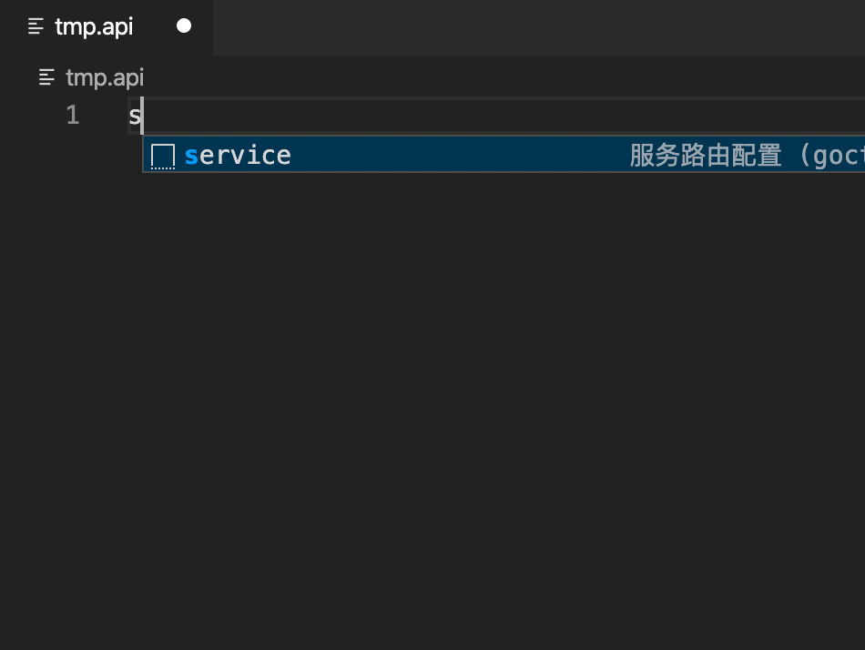
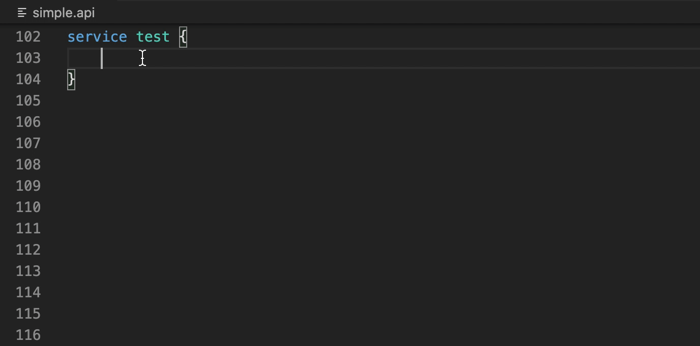

# vs code plugin
> [!TIP]
> This document is machine-translated by Google. If you find grammatical and semantic errors, and the document description is not clear, please [PR](doc-contibute.md)

The plug-in can be installed on the 1.46.0+ version of Visual Studio Code. First, please make sure that your Visual Studio Code version meets the requirements and the goctl command line tool has been installed. If Visual Studio Code is not installed, please install and open Visual Studio Code. Navigate to the "Extensions" pane, search for goctl and install this extension (publisher ID is "xiaoxin-technology.goctl").

For the extension of Visual Studio Code, please refer to [here](https://code.visualstudio.com/docs/editor/extension-gallery).

## Features

* Syntax highlighting
* Jump to definition/reference
* Code formatting
* Code block hint

### Syntax highlighting

### Jump to definition/reference

### Code formatting

Invoke the goctl command line formatting tool, please make sure that goctl has been added to `$PATH` and has executable permissions before use

### Code block hint

#### info block

#### type block

#### service block

#### handler block

