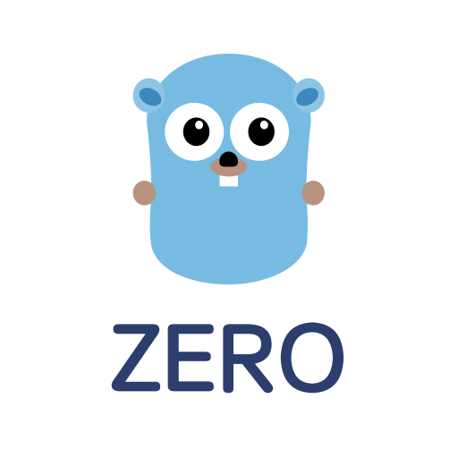

# go-zero

[English](readme-en.md) | 简体中文

## 1. 项目地址

项目官网：http://zero.gocn.vip
[https://github.com/tal-tech/go-zero](https://github.com/tal-tech/go-zero)

## 2. 项目文档

* API文档 (逐步完善中)

  [https://www.yuque.com/tal-tech/go-zero](https://www.yuque.com/tal-tech/go-zero)

* awesome系列
  * [快速构建高并发微服务](doc/shorturl.md)
  * [快速构建高并发微服务-多RPC版](docs/frame/bookstore.md)
  * [goctl使用帮助](doc/goctl.md)
  * [通过MapReduce降低服务响应时间](doc/mapreduce.md)
  * [关键字替换和敏感词过滤工具](doc/keywords.md)
  * [进程内缓存使用方法](doc/collection.md)
  * [防止缓存击穿之进程内共享调用](doc/sharedcalls.md)
  * [基于prometheus的微服务指标监控](doc/metric.md)
  * [文本序列化和反序列化](doc/mapping.md)
  * [快速构建jwt鉴权认证](doc/jwt.md)

## 3. 微信交流群

