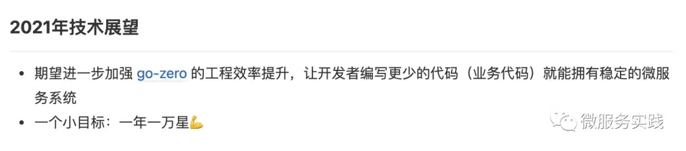
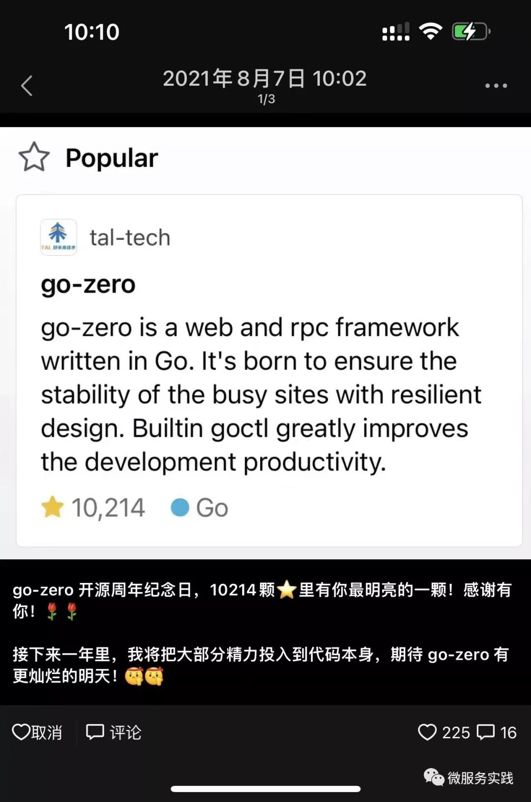
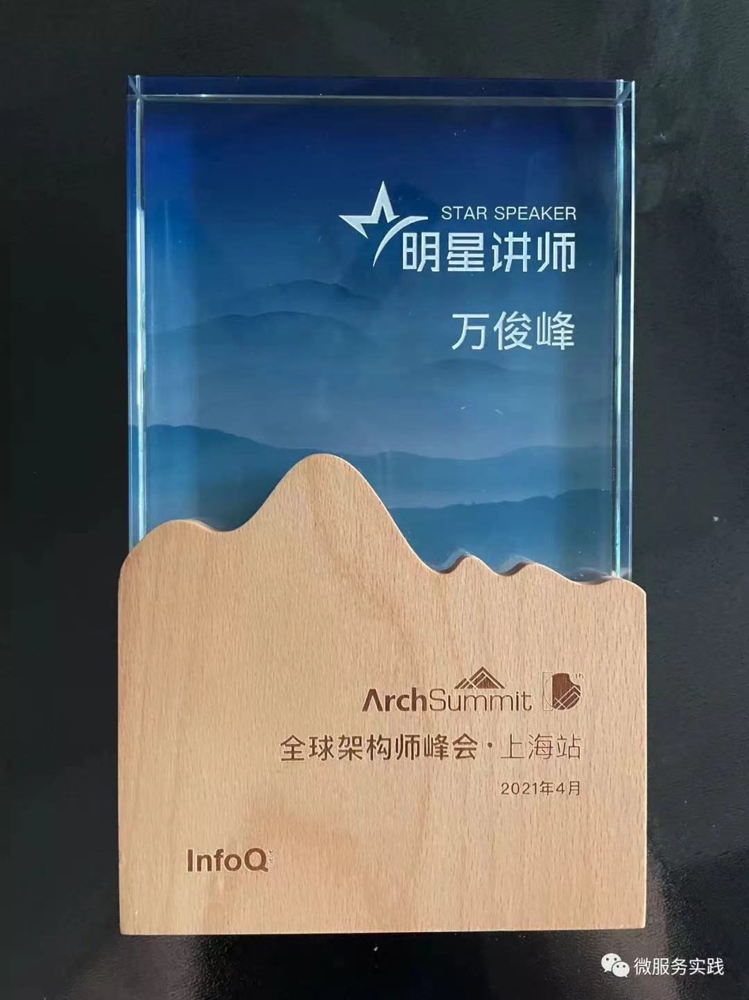
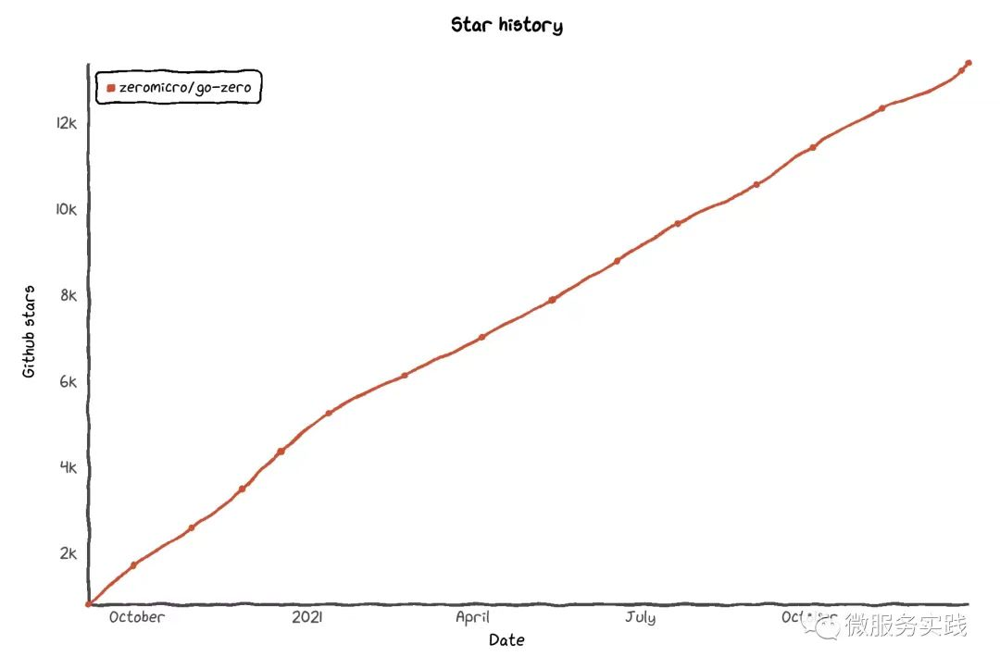

跌宕起伏的2021年快要过去了，今年对我来说经历的实在太多，提笔做个简单的总结吧。

### 回顾目标

去年的年终总结，我给自己立了两个flag。

第一个虽然不可量化，不是一个好的目标，但我认为完成的还是不错的，go-zero 的工程效率已经得到了社区的广泛认可，感谢所有使用和给我们反馈的小伙伴们！

第二个目标，虽然很调侃的用了一个“小”字，我当时觉得是很难的，但梦想真的还是要有的，万一我们实现了呢！正如我之前视频采访里说过的，人总要给自己制造一点困难，毕竟困难使人进步嘛。

这是 go-zero 开源一周年纪念日我发的朋友圈。

### 不平凡的 2021

这一年，对教育行业、对团队、对我都是非常非常不容易的。感谢好未来，虽然我离开了，但好未来确实是一个很不错的公司，期待它能够渡过磨难，再次启航！感谢晓黑板，我为之奋斗了四年，有彼此深深信任的合伙人，有志同道合、危难时刻一起冲锋陷阵的小伙伴。这真的是一段永生难忘的职业经历！

有太多的感谢和不舍，但人总是要往前看的，凡是过往，皆为序章。

### 深度参与技术社区

我本着开源精神，将好的技术和思考带给更多开发者，帮助更多开发者提升服务稳定性和开发效率，同时也提高技术认知，做了很多场深度技术分享，也给大家带来了一些技术人成长和思考的分享。

作为技术人，很多时候，我们去听一场分享，总是希望听到实实在在的技术干货，回去就能落到代码上，这真的是没错的，而且也是技术人的孜孜追求。但做了很多分享之后，我逐渐发现，其实我分享的很多有深度的技术远没有我分享的那些技术理念和设计思想对大家的影响那么深远。

对我来说，分享一个有深度的技术是授人以鱼，分享一个好的技术理念是授人以渔。

可能对听众来说，预期是来听干货的，学到好的理念那算是额外的 bonus。

就技术干货分享来说，ArchSummit 这个分享反馈还是很不错的。

演讲视频：https://www.zhihu.com/zvideo/1398226082663809024

其实我做了更多关于技术理念的分享，其中之一就是讲我为啥给项目取 go-zero 这个名字，我希望解决问题的时候是我们回到原点去思考，而不是遇到钉子就找锤子。正所谓：做正确的事，正确的做事！

我们在工作中遇到很多问题都是表象，如果你深究下去，或许这个问题本身就不存在，或者问题本身就是错的。比如最近跟老许（许式伟）做 Go+ 的时候，我们去实现了自己的 packages.Load，需要去解决 package 多次加载的缓存问题，为此写了很多代码，实现极其复杂。最后老许发现其实我们做的这些通过 Go 的一个命令就能解决，结果就是删除了上千行代码，效率提升了近20倍，而且健壮性极大提升。

最近马斯克带火了第一性原理，我的理解大体上就是：从根本出发，剔除干扰因素和惯性思考。其实我觉得跟 go-zero 这个名字说的也是同一个道理。

再比如，我应字节技术学院邀请在字节做了个技术分享，分享完，大家对干货内容给了蛮好的评价，但过后基本就忘记了，或者落地完就结束了。但有个同学很久之后微信跟我说，当时分享到现在记得最深刻、对他影响最大的是，当时有人问做前端的同学如果转做后端可行吗，我说：只要热爱，前端能做好，后端一定也能做好，技能是可以迁移的，能力是相通的。我说这些是有事实依据的，我自己做过不少前端，团队有三个大牛后端程序员最早都是做移动端的。这段送给前端想转后端又有所担心的同学，共勉！

### 开源进展

`go-zero` 收录于 CNCF 云原生技术全景图

`go-zero` 被 `CNCF Landscape` 收录：`https://landscape.cncf.io/?selected=go-zero`

多次登顶 `GitHub Go` 语言趋势榜，海外用户期望我们能用英文维护 issues 和 PR，他们也想参与社区，目前这事我还得想办法继续推进。

`go-zero` 一年万星后，我对其有两方面规划：

更多的投入到代码本身，让 go-zero 更简单易用，开发效率更高
加强生态建设，联动微服务链路上下游顶级项目共建生态
期望大家多多关注、使用 go-zero，并让我们听到你的声音（star, issue, PR），也可以加入 go-zero 社区，~7000人的社区可以帮你解决的不只是 go-zero 的使用问题。

除了 go-zero 一如既往的稳步发展（现在13.4k stars，100位 contributors）之外，我还开源了多个 Go 项目：

https://github.com/kevwan/go-stash - 超快的轻量级 Logstash 替代方案

https://github.com/zeromicro/go-queue - 基于 Kafka, Beanstalkd 的延迟任务以及 Pub/Sub 系统

https://github.com/kevwan/chatbot - 超快的 pychatter 替代方案，构建自己的聊天机器人、简易智能客服

后续还会放出更多藏货，需要抽时间整理，敬请关注我的 GitHub: https://github.com/kevwan

### 工作变动

虽然我想尽力发展好晓黑板，但无奈“双减”对行业影响过大，我还是在11月从教育行业出来了，虽然无悔，但确确实实感受到了政策对一个行业的无可比拟的影响力。

对于下一个选择，确实让我思考了很久。

首先，我给自己一个清晰的定位：尽可能投身技术，减少管理比重，因为这是我的热爱，虽然我早就过了很多人顾虑的35岁转行年龄。不管年龄多少，做自己热爱的事情才会有激情！

其次，尽可能往toD（面向开发者）业务型的公司走，因为我觉得我还是比较喜欢跟开发者打交道的，而且我自己也做了很多的技术线，对开发者深层需求还是比较理解的。

所以，最终我选择了七牛云，负责基础架构，同时我也会花不少时间去跟客户（技术人）交流，更好地理解云厂商客户的各种业务场景，这样不光对公司，对 go-zero 也是有很大好处的。同时，我也会投入不少精力来做 Go+，而开发 Go+ 又会让我更深入的理解 Go 的各种工程化的牛逼设计，真的叹为观止！如果你也想对 Go 语言深入理解的话，也可以考虑参与 Go+ 开源项目。其实吧，最大的收获是：老许（许式伟）会帮你 review 代码！

### 2022年展望

期待我能协助七牛云的基础架构和技术体系化建设再上一个新台阶
2022年希望 go-zero 能越来越好用，希望生态建设能有阶段性成果
定一个可量化的目标，2022年底到达两万星

### 致谢

感谢好未来 & 晓黑板共事过的同事对我一直的支持和帮助
感谢七牛云同事对我新入职各项事宜的热心协助
感谢各个技术 & 开源社区大家的一直陪伴
感谢 go-zero 社区广大小伙伴，参与各种 go-zero 问题和设计的讨论，助力 go-zero 飞速发展

### 项目地址

https://github.com/zeromicro/go-zero

欢迎使用 go-zero 并 star 支持我们！
